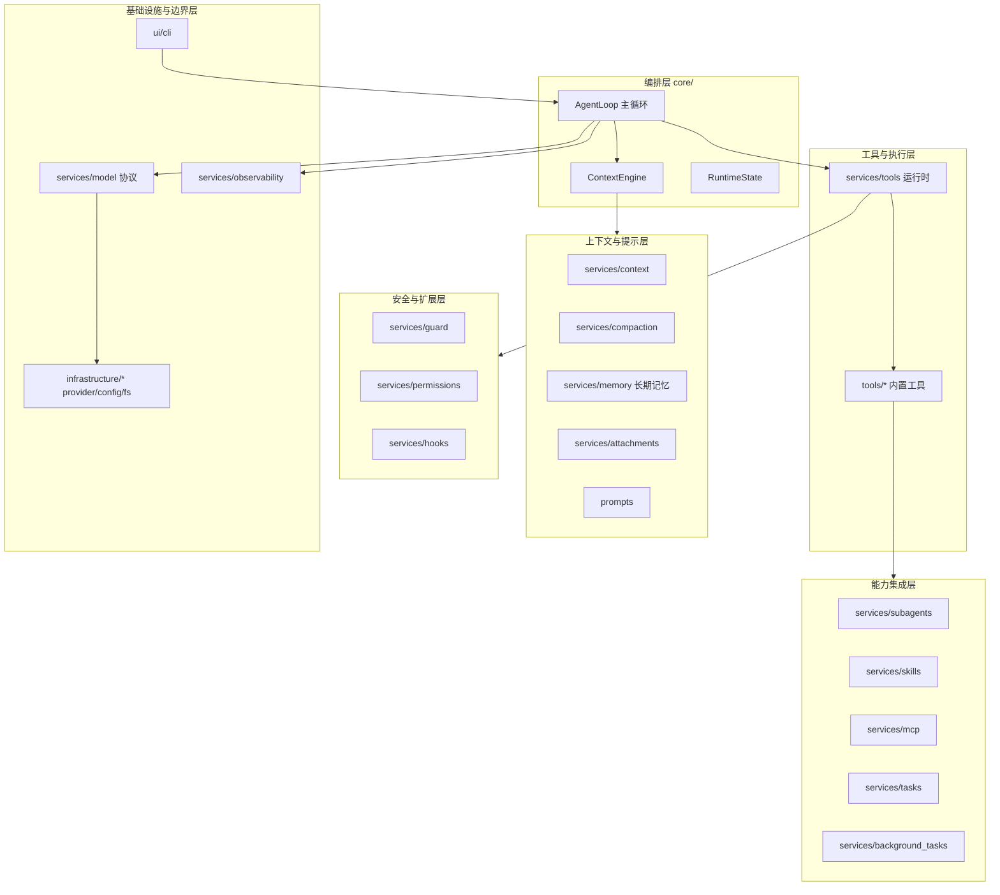

# OneCode

> Python code agent runtime — 一个围绕 agent 主循环、上下文治理、工具执行、安全边界、动态 prompt、模型适配和可观测性组成的可演化运行时。

OneCode 不是简单的 CLI wrapper。它的核心是一个薄而稳定的 agent 主循环，所有能力（工具、权限、记忆、压缩、技能、MCP、后台任务、可观测性）都以可注册、可组合、可治理的层接入，主循环只负责编排生命周期。

---

## 目录

- [项目定位](#项目定位)
- [核心特性](#核心特性)
- [架构总览](#架构总览)
- [快速开始](#快速开始)
- [常用命令](#常用命令)
- [内置工具](#内置工具)
- [模块文档索引](#模块文档索引)
- [依赖边界](#依赖边界)
- [文档导航](#文档导航)
- [许可证](#许可证)

---

## 项目定位

OneCode 是一个 Python code agent runtime。它围绕 **agent 主循环、上下文治理、工具执行、安全边界、动态 prompt、模型适配、记忆系统、子 agent、后台任务、会话记录和可观测性** 组成一个可演化的运行时。

### 设计目标

- **主循环保持薄**，只负责 agent 生命周期编排。
- **上下文、prompt、工具 schema 每轮由运行时状态动态重建**——禁用或拒绝的工具不会出现在 schema、prompt 或执行路径中。
- **工具通过 registry、descriptor、classifier 和 executor 接入**，不在主循环硬编码工具名。
- **deny-first 安全模型**：路径边界、权限判断和 hook 扩展分层处理，deny 结果不能被 hook、用户确认或 session allow 覆盖。
- **模型 provider 隔离在 infrastructure 中**，core 只依赖 provider-neutral 协议。
- **可治理的上下文**：上下文压缩、session memory、long-term memory、附件、subagent、skill、MCP、task 和后台任务都作为可注册层接入。
- **CLI 是 UI 的一种实现**，不直接承载 agent runtime 逻辑。
- **可观测性是基础设施**：transcript、trace、error log 是上下文治理、恢复和调试的一等公民。

更深层的设计信念请见 [`docs/design-docs/core-beliefs.md`](docs/design-docs/core-beliefs.md)。

---

## 核心特性

- **薄主循环编排**：`AgentLoop` 只做「上下文重建 → 模型流式调用 → 工具执行 → transition」编排，所有能力通过 registry/hook/preparer 注入。
- **元数据驱动的工具系统**：每个工具携带只读性、并发安全性、文件系统修改、结果预算、permission subject 等元数据，由统一的 `RegistryToolExecutor` 分批执行。
- **动态 prompt 组装**：`PromptAssembler` 按运行时状态组装可组合 section，而非不断膨胀的静态字符串。
- **deny-first 安全模型**：guard 做确定性路径分类，permission policy 做 deny-first 决策合并，hook 是扩展点而非安全边界替代品。
- **沙箱与跨平台路径**：基于规范化路径（含 Windows `/C:/`、`/cygdrive/c/`、`/mnt/c/` 等价形式）的边界判断，对已存在路径用 realpath 消除符号链接歧义。
- **可治理的上下文**：内存消息链、JSONL transcript、大结果外置、tool result 预算、micro/auto/manual/reactive 压缩、session memory、long-term memory、附件投影。
- **可插拔的模型 provider**：隔离在 `infrastructure/`，core/services 只依赖 `ModelClient` 协议和 `ModelStreamEvent`，不接触 provider 私有字段。
- **基于 transition 的错误恢复**：429、上下文超限、输出截断等错误被归类为明确的 `TransitionReason`，由恢复流程吸收而非直接崩溃。
- **结构化可观测性**：trace 与 error log 分离且统一脱敏，供 CLI、测试和未来 UI 共享。
- **生命周期 hook**：稳定事件点（`UserPromptSubmit`、`PreToolUse`、`PostToolUse`、`PreCompact`、`TaskCreated` 等）承载审计、记忆抽取、压缩前后处理等横切逻辑。

---

## 架构总览

OneCode 在逻辑上分为六层。每一层只依赖更下层的 provider-neutral 契约，不反向依赖编排层。



### 核心抽象

| 抽象 | 位置 | 职责 |
|:---|:---|:---|
| `AgentLoop` | `core/loop.py` | 薄主循环：每轮重建上下文 → 调用模型 → 执行工具 → 设置 transition |
| `RuntimeState` | `core/runtime_state.py` | 单会话运行状态（usage、turn count、max turns、session id、metadata） |
| `ContextEngine` | `core/context_engine.py` | 每轮模型调用前的上下文重建边界，编排 context preparer 链 |
| `ContextSnapshot` | `services/context/snapshot.py` | provider 调用前的模型可见快照 |
| `MessageStore` + `JsonlTranscriptStore` | `services/context/` | 内存优先消息链 + 持久化 transcript |
| `ModelClient` | `services/model/client.py` | provider-neutral 模型协议（`stream(snapshot)`） |
| `ToolDescriptor` + `ToolRegistry` | `services/tools/` | 工具事实来源 + 统一执行入口 |
| `SandboxGuard` + `PermissionPolicy` | `services/guard/` + `services/permissions/` | 确定性路径分类 + deny-first 决策合并 |
| `HookRegistry` | `services/hooks/` | 生命周期扩展点（不能绕过 deny） |
| `TraceRecorder` + `ErrorLogRecorder` | `services/observability/` | 结构化可观测性入口 |

### 运行流程（每轮）

1. CLI 收集 `@mention` 附件 → 交给 `AgentLoop.stream(prompt, attachments)`
2. 触发 `UserPromptSubmit` hook → 追加 user message + durable attachment
3. 超过 `max_turns` 时设置 `max_turns` transition 并停止
4. `ContextEngine` 重建 `ContextSnapshot`（attachment → memory → compaction preparer 链）
5. 经 `ModelRetryRunner` 调用 `ModelClient.stream(snapshot)`，retryable error 触发指数退避
6. 触发 `AssistantMessageCompleted` hook（可触发 session memory 提取）
7. 若有 tool calls → `RegistryToolExecutor`（preflight → guard → permission → hook → handler → 结果预算 → trace）→ 设置 `tool_use` → 续轮
8. 若无 tool calls → 触发 `TurnStopped` hook → 设置 `completed` → 返回

---

## 快速开始

### 环境要求

- Python ≥ 3.11
- [uv](https://docs.astral.sh/uv/)（推荐的包管理与虚拟环境工具）

### 安装

```bash
# 同步虚拟环境（含开发依赖）
uv sync --dev

# Windows 激活虚拟环境
.\.venv\Scripts\Activate.ps1

# 复制环境变量模板（OneCode 只从 .env 读取模型 provider 配置）
cp .env.example .env
```

`.env` 中至少需要配置以下变量（取决于你选择的 provider）：

```env
ONECODE_PROVIDER=openai-compatible
ONECODE_BASE_URL=https://api.example.com/v1
ONECODE_API_KEY=sk-...
ONECODE_MODEL=claude-opus-4-8
```

### 运行

```bash
# 启动 TTY 内联终端 REPL
uv run python -m ui.cli.app

# Batch 模式（stdin 非 TTY 时自动走 batch 路径）
echo "hello" | uv run python -m ui.cli.app
```

CLI 采用 **内联终端渲染模型**（基于 `prompt_toolkit` + Rich）：定稿内容进入 scrollback；流式预览、斜杠补全画在可擦除的动态区；`/status`、`/resume` 等临时界面进入备用屏幕（DEC 1049）。

---

## 常用命令

```bash
# 运行完整测试套件
uv run python -m pytest tests -q

# 运行单个测试文件
uv run python -m pytest tests/<file>.py -q

# 编译检查
uv run python -m compileall core services infrastructure

# 验证依赖边界（结构性变更后必跑）
uv run python -m pytest tests/test_import_boundaries.py -q
```

---

## 内置工具

`tools/` 目录下是 OneCode 的内置工具，由 `services/tools/` 的统一运行时调度：

| 工具 | 类型 | 关键能力 |
|:---|:---|:---|
| `read_file` | 只读 | 读取 sandbox 内 UTF-8 文本，支持 `offset`/`limit` 自限流 |
| `edit_file` | 写 | exact string replacement；新建/多重匹配/diff 友好 |
| `write_file` | 写 | 整文件写入；要求已读快照；返回 unified diff |
| `glob` | 只读 | 用 `rglob` + fnmatch 发现文件，按 mtime 降序分页 |
| `grep` | 只读 | 外部 `rg` 搜索；支持 `content`/`files_with_matches`/`count` |
| `bash` | 视命令 | 通过 Git Bash 执行；4 级安全模型；支持后台运行 |
| `agent` | 子 agent | 启动子 agent 处理子任务，可后台 |
| `skill` | skill 加载 | 按需加载 skill |
| `task_create` / `task_get` / `task_list` / `task_update` | 任务系统 | 文件持久化任务 + 依赖图 + claim |
| `background_task_stop` | 后台任务 | 停止后台 bash/agent |

MCP 工具在运行时动态发现并注入 `ToolRegistry`，不放在 `tools/` 目录下。

### 添加工具

新工具应通过 `descriptor()` 注册 metadata 和 handler，而非在主循环中新增工具名分支。完整规范见 [`docs/design-docs/tool-design-guidelines.md`](docs/design-docs/tool-design-guidelines.md)。

---

## 模块文档索引

完整模块文档位于 `docs/design-docs/`：

**编排与上下文**

- [`core-runtime-architecture.md`](docs/design-docs/core-runtime-architecture.md) — `core/` 编排层
- [`context-architecture.md`](docs/design-docs/context-architecture.md) — 消息链 / transcript / 快照
- [`compaction-architecture.md`](docs/design-docs/compaction-architecture.md) — 压缩与 session memory
- [`memory-architecture.md`](docs/design-docs/memory-architecture.md) — 长期记忆与指令记忆
- [`attachment-architecture.md`](docs/design-docs/attachment-architecture.md) — `@mention` 与附件投影
- [`prompt-architecture.md`](docs/design-docs/prompt-architecture.md) — 动态 system prompt

**工具与安全**

- [`tool-runtime-architecture.md`](docs/design-docs/tool-runtime-architecture.md) — 工具运行时
- [`builtin-tools-architecture.md`](docs/design-docs/builtin-tools-architecture.md) — 内置工具职责
- [`guard-architecture.md`](docs/design-docs/guard-architecture.md) — 沙箱与路径安全
- [`permission-architecture.md`](docs/design-docs/permission-architecture.md) — 权限决策
- [`hook-architecture.md`](docs/design-docs/hook-architecture.md) — 生命周期扩展点

**能力集成**

- [`subagent-architecture.md`](docs/design-docs/subagent-architecture.md) — 子 agent
- [`skill-architecture.md`](docs/design-docs/skill-architecture.md) — skill 系统
- [`mcp-architecture.md`](docs/design-docs/mcp-architecture.md) — MCP 集成
- [`task-architecture.md`](docs/design-docs/task-architecture.md) — 任务系统
- [`background-task-architecture.md`](docs/design-docs/background-task-architecture.md) — 后台任务

**边界与界面**

- [`model-provider-architecture.md`](docs/design-docs/model-provider-architecture.md) — 模型与 provider
- [`observability-architecture.md`](docs/design-docs/observability-architecture.md) — trace 与 error log
- [`cli-architecture.md`](docs/design-docs/cli-architecture.md) — CLI 界面

**横切约定**

- [`core-beliefs.md`](docs/design-docs/core-beliefs.md) — 设计信念与反模式
- [`tool-design-guidelines.md`](docs/design-docs/tool-design-guidelines.md) — 新增工具约定

---

## 依赖边界

以下约束由 `architecture.md` 定义并由 `tests/test_import_boundaries.py` 强制检查：

- `core/loop.py` **不能** import 具体工具目录，也不能 import 具体 provider。
- `services/tools/` **不能**静态 import 顶层 `tools/<tool_name>/`。
- `tools/` 可依赖 `services.tools` 公共类型和 `ToolRuntime`，但**不能**依赖 `core/loop.py`。
- `infrastructure/` **不能**依赖 `core/`。
- `prompts/` 可读取工具 descriptor 的 prompt 文本，但**不能**执行工具。
- `services/guard/` 的 deny 结果**不能**被 hook、session allow、permission prompter 或模型请求覆盖。

依赖方向：

```text
ui / application composition → core
core → services 契约 (context/model/tools/hooks/observability) + prompts 协议
context preparer 链 → services.context / compaction / memory / attachments
tools → services.tools 类型 / ToolRuntime
services.tools → services.guard / permissions / hooks
infrastructure.providers → services.model / context / tools 类型
services.guard → infrastructure.filesystem
services.* → services.errors (仅 stdlib)
```

---

## 文档导航

| 文档 | 用途 |
|:---|:---|
| [`architecture.md`](architecture.md) | 根架构说明：分层、依赖方向、核心抽象、运行流程 |
| [`AGENTS.md`](AGENTS.md) | 贡献者入门：文档阅读顺序、依赖边界、常用命令 |
| [`PLANS.md`](PLANS.md) | ExecPlan 的要求和格式 |
| [`tech_debt_tracker_guide.md`](tech_debt_tracker_guide.md) | 技术债务条目规范 |
| [`docs/design-docs/`](docs/design-docs/) | 模块级架构与设计文档 |
| [`docs/exec-plans/active/`](docs/exec-plans/active/) | 当前在执行的实现计划 |
| [`docs/exec-plans/completed/`](docs/exec-plans/completed/) | 已完成的实现计划（仅作历史参考） |
| [`docs/tech-debt/`](docs/tech-debt/) | 技术债务跟踪 |
| [`docs/references/`](docs/references/) | 外部参考与背景资料 |

---

## 许可证

见 [`LICENSE`](LICENSE)。