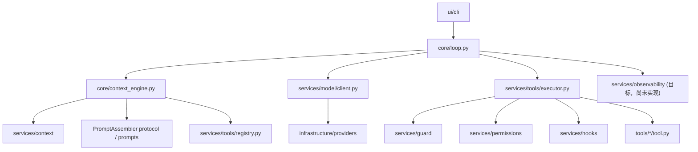

# OneCode 架构

本文描述 OneCode 的目标架构，并在已经实现的部分按当前代码校准。未实现的模块仍保留原有目标形态，作为后续实现边界；本文不描述临时 demo 或历史实现。

## 架构目标

OneCode 是一个 code agent runtime。它的核心不是 CLI wrapper，而是围绕主循环、上下文重建、工具执行、hook、guard、动态 prompt、模型适配、压缩和可观测性组成的可演化系统。

目标架构需要满足几个要求：

- 主循环保持薄，只负责 agent 生命周期编排。
- 上下文重建是核心能力，由 `core/context_engine.py` 负责调度。
- `services/` 放实现 agent 能力所需的服务、抽象接口和通用运行时组件。
- 具体工具独立放在顶层 `tools/`，每个工具一个子目录。
- `prompts/` 独立负责动态 prompt 组装。
- `guard` 负责项目路径边界、路径解析和安全策略，不和 hook 混在一起。
- CLI 是 UI 的一种实现，放在 `ui/cli/`。
- 模型 provider、配置加载、文件系统适配等基础设施放在 `infrastructure/`。

当前已实现的骨架已经落地了 thin loop、context snapshot 边界、registry-backed 工具运行时、文件 sandbox guard、基础 hook、OpenAI Chat Completions 兼容 provider、provider catalog/model discovery、基础 JSONL 会话 transcript、`read_file` / `edit_file` / `glob` / `grep` 文件工具、基于 Tree-sitter AST 分类的 Git Bash `bash` 工具、第一版动态 system prompt 组装，以及第一版标准库 `ui/cli/` 交互主界面。`services/compaction/` 和 `services/observability/` 仍是目标模块。

## 目标目录结构

以下目录树同时展示当前已落地的模块和仍保留的目标模块。标注为“目标，尚未实现”的目录或文件不应被理解为当前代码已经存在。

```text
OneCode/
  core/
    loop.py
    context_engine.py
    runtime_state.py
    transitions.py

  services/
    tools/
      registry.py
      executor.py
      schema.py
      types.py
    permissions/
      types.py
      policy.py
      session.py
      prompter.py
    hooks/
      registry.py
      events.py
      builtin.py                 # 目标，尚未实现
    compaction/                  # 目标，尚未实现
      service.py
      result_store.py
    context/
      snapshot.py
      message_store.py
      transcript.py
      projector.py               # 目标，尚未实现
    guard/
      resolver.py
      boundary.py
      policy.py
    model/
      client.py
      types.py
    observability/               # 目标，尚未实现
      events.py
      trace.py

  prompts/
    assembler.py
    cache.py
    sections.py
    runtime_context.py

  tools/
    read_file/
      __init__.py
      tool.py
      prompt.py
    edit_file/
      __init__.py
      tool.py
      prompt.py
    write_file/                  # 目标，尚未实现
      tool.py
      prompt.py
    bash/
      __init__.py
      ast_model.py
      parser.py
      paths.py
      prompt.py
      readonly.py
      runner.py
      semantics.py
      tool.py
    glob/
      __init__.py
      tool.py
      prompt.py
    grep/
      __init__.py
      tool.py
      prompt.py

  infrastructure/
    providers/
      chat_completions.py
      http.py
      catalog.py
      model_catalog.py
      factory.py
      connection.py
    config/
      env.py
    filesystem/
      paths.py

  ui/
    __init__.py
    cli/
      __init__.py
      app.py
      commands.py
      renderer.py
      types.py
```

## 模块职责

### core/

`core/` 放 agent runtime 最关键的编排代码。

`core/loop.py` 是主循环。当前实现接收用户输入，将用户消息写入 `MessageStore`，循环构建 `ContextSnapshot`，调用模型客户端，累计 usage，写入 assistant message，按实际 `tool_calls` 而不是 `stop_reason` 判断是否执行工具，并在没有工具调用时返回最终文本。它已经处理 `tool_use`、`completed` 和 `max_turns` transition。它不直接实现具体工具、具体 provider、路径判断、压缩细节或 prompt 文本。

当前 `core/loop.py` 还没有直接触发 `UserPromptSubmit` 或 `Stop` hook，也没有捕获 provider error、context limit、max output interruption 等恢复路径。这些 transition 名称已在 `core/transitions.py` 中定义，恢复行为仍是目标能力。

`core/context_engine.py` 是上下文重建边界。当前实现从 `MessageStore` 读取当前消息，调用可注入的 `ContextPreparer`、`PromptAssembler` 和 `ToolSchemaProvider`，返回 `ContextSnapshot`。默认 preparer 是 no-op，默认 prompt assembler 是 `DynamicPromptAssembler`，默认 tool schema provider 返回空 schema。它已经支持由 `ToolRegistry` 动态提供模型可见工具 schema，并能通过 `prompts/` 生成基础动态 system prompt；context projector 和 compaction service 仍是目标能力。

`core/runtime_state.py` 保存会话运行状态。当前字段包括 usage、turn count、max turns、reactive compact 标记、max-output recovery 计数、last transition、session id 和 metadata。文件工具通过 metadata 记录本轮已读文件，供 `edit_file` 执行前校验。

`core/transitions.py` 定义 runtime transition，例如 `tool_use`、`completed`、`rate_limit_retry`、`reactive_compact_retry`、`max_output_tokens_escalate`、`max_output_tokens_recovery`、`stop_hook_continue`、`max_turns`。当前 loop 已消费 `tool_use`、`completed` 和 `max_turns`；其余恢复类 transition 仍是后续实现目标。

### services/

`services/` 放 agent 能力的服务层。这里可以包含抽象接口、通用实现和 runtime 服务，但不放具体业务工具。

#### services/tools/

工具服务负责工具注册、schema 生成、工具 prompt 暴露、工具执行和结果归一化。

`types.py` 当前定义 provider-neutral 的 `ToolCall`、`ToolExecutionResult`、`ToolRuntime`、`ToolDescriptor`、`ValidationResult`、`ToolTarget`、`ToolResultPolicy` 和 `ToolCallClassification`。工具 descriptor 已包含 `output_schema`、工具 prompt、search hint、工具级 validator、input-aware classifier 和 handler。

当前工具分类以单次调用输入为准。`ToolCallClassification` 描述本次调用是否只读、是否修改文件系统、是否可并发、触达哪些 `ToolTarget`、结果预算策略和权限审计 subject。分类失败默认 fail closed。

`registry.py` 管理当前启用的工具集合。模型可见工具从 registry 动态生成，不能在主循环中硬编码。当前 registry 会按工具名排序输出 descriptor，并通过 `visible_descriptors(state)` 生成统一的模型可见工具视图；`tool_schemas(state)` 和 `tool_prompt_sections(state)` 都基于该视图。可见性支持 registry 构造期的 disabled/denied 工具名、`RuntimeState.metadata` 中的 `disabled_tools`、`denied_tools` 或 `hidden_tools`，以及注入的 `PermissionPolicy` 中的工具级 deny/disabled。路径参数级权限仍在执行入口根据实际输入判断。

`schema.py` 负责把内部工具描述转换为 provider 所需的 tool schema。当前实现是 OpenAI Chat Completions compatible 的 function schema 投影。

`executor.py` 当前实现 `RegistryToolExecutor`。执行流程包括查找工具、JSON Schema 形状校验、工具级 `validate_input`、`classify_input`、基于 `ToolTarget` 收集 guard policy、交给 permission policy 做 deny/ask/allow 决策、必要时调用注入的 permission prompter、`PreToolUse` hook、hook 更新输入后的重新校验/重新分类/重新 guard/重新 permission、调用 handler、应用 `ToolResultPolicy`、触发 `PostToolUse` 或 `ToolError` hook，并把结果转换为统一 `ToolExecutionResult`。

当前 executor 串行执行 provider 返回的工具调用，并保持 provider 顺序。`concurrency_safe` 已作为分类 metadata 暴露，但尚未驱动并发分批。结果预算已能把超出 `max_result_size_chars` 的内容替换为 JSON 预览和截断 metadata，但还没有接入 durable result store；`persist_when_exceeded` 当前不执行持久化。

具体工具不放在这里。`services/tools/` 是工具运行时，顶层 `tools/` 是工具实现。

#### services/hooks/

hook 服务负责 runtime 生命周期事件扩展。

`events.py` 当前已实现稳定事件 `PreToolUse`、`PostToolUse` 和 `ToolError`。

`registry.py` 管理 hook 注册和顺序执行。hook callback 可以返回 blocking error、updated input 和 metadata。callback 异常会被记录到 hook metadata，不会中断 hook 链。`PreToolUse` 更新输入后，executor 会重新执行 schema validation、tool validation、classification 和 guard，因此 hook 不能借输入改写绕过 guard。

`UserPromptSubmit`、`PreCompact`、`PostCompact`、`Stop` 和 `builtin.py` 仍是目标能力。hook 是扩展点，不是安全边界的唯一来源。涉及路径边界和项目访问规则时，必须交给 `services/guard/` 做确定性判断。

#### services/permissions/

权限服务负责把工具级 deny/disabled、guard 结果、危险目录规则、可疑路径规则、session 临时授权和 UI 用户确认合并成一次工具调用的最终决策。

`types.py` 当前定义 provider-neutral 的 `PermissionDecision`、`PermissionRequest`、`PermissionResponse` 和 `PermissionOption`。这些结构不绑定 CLI；CLI、测试或未来 UI 都可以实现自己的 prompter。

`session.py` 当前实现内存中的 `SessionPermissionStore`，支持本 session 内按工具名、operation 和目录授权，也支持 session 级工具 deny/disabled。它不写磁盘，`/clear` 和 `/resume` 会清理临时授权。

`policy.py` 当前实现第一版 `PermissionPolicy`。执行顺序是 deny-first：工具级 deny/disabled 先拒绝，guard deny 先拒绝；随后对 `.git`、`.vscode`、`.idea`、`.onecode` 等项目危险目录、可疑 Windows 路径形式和 guard ask 返回 `ask`；session allow 只能覆盖 ask，不能覆盖任何 deny。被 policy 工具级拒绝的工具会从 registry 的可见工具视图中消失。

`prompter.py` 定义 `PermissionPrompter` protocol。当前 CLI 提供同步阻塞实现；非交互 executor 未注入 prompter 时会把 ask 转换成结构化 `permission_ask_required` 工具结果，保持 fail closed。

#### services/compaction/

compaction 是目标服务，负责治理 agent 工作内存。当前目录尚未实现，`ContextEngine` 默认使用 `NoOpContextPreparer`。

目标上，`service.py` 提供压缩入口，包括工具结果预算、旧工具结果清理、滑动窗口、主动 full compact 和 reactive compact。

`result_store.py` 负责大工具结果持久化、预览生成和引用恢复。

compaction 不直接决定主循环是否继续。它向 `core/context_engine.py` 返回压缩后的上下文投影或状态更新。

#### services/context/

context 服务负责消息存储、基础会话 transcript、模型可见上下文投影和快照结构。

`message_store.py` 当前实现内存优先的 append-only session message store。它支持追加 user message、assistant message 和内部 `tool_result` message，并在读取时返回 deepcopy，避免外部调用方直接修改内部状态。每次追加消息都会进入 JSONL transcript store 的缓冲区，由定时 flush 和正常退出 flush 写入磁盘。

`transcript.py` 当前实现 `.onecode/<session_id>/messages.jsonl` 的基础会话持久化。每条 record 包含 `uuid`、`parent_uuid`、`session_id`、`timestamp`、`cwd` 和内部 `message`。超过 50KB 的 `tool_result.content` 会写入 `.onecode/<session_id>/tool-results/<tool_call_id>.txt`，JSONL 只保留预览和引用 metadata；从 JSONL 恢复时会读取外置文件并补回内存消息。

`snapshot.py` 当前定义 `ContextSnapshot`，包含 system prompt、messages、tool schemas、usage hints、transcript refs 和当前 transition。

`projector.py` 仍是目标模块。目标上，它负责把内部消息状态投影为模型调用所需的 message list，可以隐藏、替换或引用过大的历史内容。

当前 provider adapter 已在 `infrastructure/providers/chat_completions.py` 中把内部 `role="tool_result"` 消息投影为 Chat Completions wire format 的 `role="tool"` 消息。长期目标仍是让通用投影和上下文治理进入 `services/context/` 与 `services/compaction/` 边界。

#### services/guard/

guard 负责项目访问边界和安全策略。

`resolver.py` 当前作为路径解析 facade，导出 `resolve_path`、`resolve_write_target`、`normalize_path_pattern`、`windows_path` 和相关类型。底层跨平台路径处理位于 `infrastructure/filesystem/paths.py`。

`boundary.py` 当前定义 `SandboxBoundary` 和路径分类。边界支持 cwd、worktree、extra allowed dirs 和 denied patterns。分类结果包括 `inside_workspace`、`inside_worktree`、`inside_extra_allowed`、`external_directory` 和 `denied`。实现会处理 Windows 等价路径形式、符号链接 realpath、缺失写入目标的父目录解析、根目录 worktree 保护，以及基于 `relative_to` 语义的包含判断。

`policy.py` 当前定义 `SandboxGuard` 和 `GuardPolicy`。guard 将路径分类映射为 `allow`、`ask` 或 `deny`：denied pattern 命中时返回 deny，外部目录返回 ask，workspace/worktree/extra allowed 返回 allow。blocked policy 可以转换为结构化 tool error payload。

guard 与 hooks 的关系是：guard 做确定性安全判断，hook 做生命周期扩展和额外拦截。hook 不能覆盖 guard 的 deny 结果。当前 executor 在 `PreToolUse` hook 前先执行 guard 和 permission policy；如果原始输入已经被 deny，hook 没有机会把它改成 allowed 路径。hook 更新输入后会重新执行 schema validation、工具 validation、classification、guard 和 permission policy。

permission policy 位于 guard 和 handler 之间。guard 只分类路径边界并给出 allow/ask/deny；permission policy 决定 ask 是否需要暂停询问用户，以及 session allow 是否能覆盖这次 ask。具体工具 handler 仍会重复 guard 作为兜底，并通过 executor 注入的已批准 guard policy 识别本次已获用户允许的 ask。deny 结果不能被 permission prompter、session allow 或 hook 覆盖。

#### services/model/

模型服务定义 OneCode 内部的模型边界。

`client.py` 当前定义模型客户端协议 `send(snapshot) -> LLMResponse`。未来 streaming、summarize 和 fallback 能力应继续放在该边界之后。

`types.py` 当前定义归一化响应结构，包括 `LLMResponse`、`ModelUsage` 和 `ProviderError`。`LLMResponse` 包含 assistant message、final text、tool calls、stop reason、usage 和 `output_interrupted` 标记。`ProviderError` 携带 provider id、status code、error type 和 retryable metadata。

`services/model/` 不放具体 provider 实现。具体 Chat Completions、Responses API 或其他 provider 适配放在 `infrastructure/providers/`。

#### services/observability/

可观测性服务是目标模块，当前目录尚未实现。

目标上，`events.py` 定义 trace event，例如 `model_call_start`、`model_call_end`、`tool_use_start`、`tool_use_end`、`compact_start`、`compact_end`、`transition`。

`trace.py` 负责写入 JSONL trace 或提供给 UI 渲染。

可观测性不是 debug 文本。它应该成为 CLI、测试、回放和未来 UI 共享的事实来源。

### prompts/

`prompts/` 负责动态 prompt 组装。第一版已经实现 `PromptRuntimeContext`、可组合 `PromptSection`、进程内 `PromptSectionCache` 和 `DynamicPromptAssembler`。

当前 `core/context_engine.py` 定义可注入的 `PromptAssembler` protocol，默认使用 `DynamicPromptAssembler(Path.cwd())` 生成非空 system prompt。CLI 装配会显式创建 `DynamicPromptAssembler(workspace, tool_registry=registry)`，因此模型可见 prompt 会包含 OneCode identity、行为规则、当前工作目录、已读文件、可用工具摘要和每个可见工具的工具专属 prompt。

`runtime_context.py` 定义 prompt 组装所需的第一版输入：`RuntimeState`、cwd、可见工具、已读文件和 transition。它刻意不包含 session id、CLI mode、provider 配置、API key 或 transcript 路径。

`sections.py` 放可组合 section。当前 section 包括 identity、behavior rules、workspace state、available tools 和 per-tool prompt。section 输出顺序稳定，空工具 prompt 会被跳过。

`cache.py` 提供 section 级缓存。缓存 key 由 section key 和 fingerprint 组成；fingerprint 覆盖 cwd、已读文件、可见工具、工具 prompt 文本和 prompt 版本等会影响输出的输入。

工具专属 prompt 不放在 `prompts/`，而是放在对应的 `tools/<tool_name>/prompt.py`。`prompts/assembler.py` 从 `ToolRegistry.visible_descriptors(state)` 读取当前可见工具，再注入这些工具的 prompt。用户偏好、语言偏好、memory、skill、task 和 compaction 状态仍是后续 prompt section 的目标能力。

### tools/

`tools/` 放具体工具实现。每个工具一个子目录，包含工具逻辑和工具专属 prompt。

当前已实现：

- `tools/read_file/`：读取 sandbox 内 UTF-8 文本文件，返回带行号内容。输入包括 `file_path`、`offset` 和 `limit`。分类为只读、可并发、文件 read target，结果策略为无限制且不持久化。执行成功后会把规范化路径记录到 `RuntimeState.metadata["files_read"]`。
- `tools/edit_file/`：对 sandbox 内文本文件执行 exact string replacement。输入包括 `file_path`、`old_string`、`new_string` 和 `replace_all`。分类为文件 write target、不可并发。编辑已有文件前要求该文件已在本 session 中被读取；当目标文件不存在且 `old_string` 为空时可以创建新文件；多重匹配默认要求更精确上下文或 `replace_all=true`。
- `tools/glob/`：按路径通配模式发现 sandbox 内文件。输入包括 `pattern`、`path`、`head_limit` 和 `offset`。分类为只读、可并发、directory list target，handler 会对搜索根和每个候选结果执行 guard 检查，结果按修改时间降序分页返回。
- `tools/grep/`：通过 `rg` ripgrep 搜索 sandbox 内文件内容。输入包括 `pattern`、`path`、`glob`、`output_mode`、上下文参数、大小写和分页参数。分类为只读、可并发、文件系统 read target，handler 会对搜索根和每个 ripgrep 结果执行 guard 过滤，并把 ripgrep 失败转换为结构化工具错误。
- `tools/bash/`：通过 Git Bash 执行 shell 命令。输入包括 `command`、`timeout_ms` 和 `description`。分类先使用 `tree-sitter` / `tree-sitter-bash` 解析 Bash AST，再从 simple command、argv 和 redirect 派生文件系统 target；`check_semantics()` 拒绝无法静态理解的 wrapper、eval-like builtin 和动态代码执行形态。只读 allowlist 命令可自动执行但仍受 guard 约束；写入、删除、未知副作用或 parse/semantic failure 会生成 `command/execute` target，并由 `PermissionPolicy` 触发 CLI 权限确认。runner 使用 Git Bash 的 `bash --noprofile --norc -lc`，找不到 Git Bash 时返回结构化 `git_bash_not_found` 错误。

目标工具仍包括 `write_file`。

`tool.py` 定义工具描述、输入 schema、输出 schema、metadata、validator、classifier 和 handler。

`prompt.py` 定义模型理解该工具所需的描述、使用约束和可选 few-shot 片段。

工具实现不应该直接修改主循环状态。工具只接收明确的 runtime 输入，返回结构化结果。路径类工具必须调用 `services/guard/` 或通过 `ToolRuntime` 间接使用 guard。

示例：

```text
tools/read_file/
  tool.py
  prompt.py
```

`tool.py` 提供读取文件能力，`prompt.py` 提供该工具对模型可见的使用说明。

### infrastructure/

`infrastructure/` 放基础设施适配。

`infrastructure/providers/chat_completions.py` 当前实现 OpenAI Chat Completions 兼容 provider，把外部协议转换为 `services/model/types.py` 中的内部结构。它负责构造 system/user/assistant/tool messages、附加工具 schema、解析 text response、解析 provider tool calls、生成 fallback tool call id、解析 usage，并把内部 `tool_result` 消息投影为 provider wire format。

`infrastructure/providers/http.py` 当前实现小型 JSON HTTP transport，支持 `post_json` 和 `get_json`，并把 HTTP、URL、timeout 和 invalid JSON 错误转换为 `ProviderError`。429 和 5xx 被标记为 retryable，但主循环恢复流程尚未消费这些 retryable metadata。

`infrastructure/providers/catalog.py` 当前定义内置 OpenAI-compatible provider catalog，包括 `openai`、`deepseek`、`glm`、`minimax`、`siliconflow`、`gemini`、`claude-openai-compatible` 和 `custom`。

`infrastructure/providers/model_catalog.py` 当前通过 provider 的 `/models` 端点发现模型，并解析为 `ProviderModel`。

`infrastructure/providers/factory.py` 当前提供从 `.env` 创建模型客户端和模型 catalog 客户端的入口。

`infrastructure/providers/connection.py` 当前提供 provider connection option 列表，作为未来 CLI `/connect` flow 的基础。

`infrastructure/config/env.py` 从项目根目录 `.env` 读取运行时配置，例如默认模型 provider、模型名、网关地址、API key、请求超时、额外 headers 和默认请求参数。模型 provider 配置只从 `.env` 读取，不从系统环境变量或项目 JSON/TOML 配置读取；dotenv interpolation 已禁用。

`infrastructure/filesystem/paths.py` 放跨平台路径处理的底层工具函数。更高层的边界判断仍属于 `services/guard/`。

基础设施不反向依赖 core。provider adapter 可以依赖 `services/model`、`services/context` 和 `services/tools` 中的 provider-neutral 类型来完成协议转换；`services/guard` 可以调用 `infrastructure/filesystem` 的底层路径工具。当前 provider factory 会被应用装配层调用来创建 `ModelClient`，core 只依赖 `services/model/client.py` 的协议。

### ui/

`ui/` 放用户界面。CLI 是 UI 的一种具体实现。当前 `ui/cli/` 已落地第一版标准库交互界面，可通过 `uv run python -m ui.cli.app` 启动。

`ui/cli/app.py` 负责启动 CLI 应用、创建 runtime、进入单行交互循环。它装配 `RuntimeState`、`MessageStore`、`ContextEngine`、provider model client、固定 `read_file` / `edit_file` / `glob` / `grep` 工具 registry、`SandboxGuard`、`SessionPermissionStore`、`PermissionPolicy`、CLI permission prompter 和 `RegistryToolExecutor`，再把普通 prompt 交给 `AgentLoop.run()`。

`ui/cli/commands.py` 处理 `/help`、`/tools`、`/status`、`/history`、`/resume`、`/clear`、`/exit` 和 `/quit`。`/resume` 可以从 `.onecode/<session_id>/messages.jsonl` 或显式 JSONL 路径恢复当前会话。

`ui/cli/renderer.py` 负责把启动信息、状态、工具列表、历史摘要、assistant 文本和错误渲染为终端文本。`ui/cli/types.py` 放共享 `CliRuntime` 和 `CommandResult`，避免应用入口和命令处理形成循环导入。

当前 CLI 仍是轻量第一版：已支持同步权限交互面板，但不支持 streaming token、结构化 observability 订阅、`/compact`、provider connect/model selection flow 或完整错误恢复 UI。这些能力应在相应 runtime 服务落地后再接入 CLI。

UI 不直接实现 agent 逻辑。UI 调用 core，并订阅 services/observability 的事件来展示状态。

## 运行流程



当前每轮任务的执行顺序：

1. 调用方把用户输入传给 `AgentLoop.run(prompt)`。
2. `core/loop.py` 把用户消息追加到 `MessageStore`。
3. loop 递增 turn count，并在超过 `max_turns` 时设置 `max_turns` transition 后停止。
4. `core/context_engine.py` 重建本轮 `ContextSnapshot`。
5. context engine 调用 context preparer、prompt assembler 和 tool schema provider。
6. loop 使用 `services/model/client.py` 协议调用模型。
7. provider 返回被归一化的 `LLMResponse`。
8. loop 记录 usage，并把 assistant message 写回 message store。
9. 如果响应包含 tool calls，loop 交给 `services/tools/executor.py`。
10. executor 校验输入、分类工具调用、检查 guard、运行 permission policy、必要时询问 UI prompter、运行 hook、执行具体工具，并返回 tool results。
11. tool results 写回 message store，loop 设置 `tool_use` transition 并进入下一轮。
12. 如果响应不包含 tool calls，loop 设置 `completed` transition 并返回最终结果。

目标运行流程还包括 `UserPromptSubmit` hook、`Stop` hook、compaction、transcript/result store、structured observability，以及 provider/context/max-output 的恢复 transition。

## 依赖方向

依赖方向应保持核心与具体实现解耦：

```text
ui / application composition -> core
core -> services contracts
core -> prompts protocol / prompts target
tools -> services.tools types / ToolRuntime
infrastructure.providers -> services.model/context/tools types
services.guard -> infrastructure.filesystem
```

当前已实现代码中，`core/loop.py` 只依赖 context engine、runtime state、transition、message store、model client protocol 和 tool executor protocol，不 import 具体工具或具体 provider。具体工具由应用装配层创建 descriptor 后注入 `ToolRegistry`；`services/tools/` 只通过 descriptor 调用 handler，不静态 import `tools/read_file` 或 `tools/edit_file`。具体 provider 通过 `infrastructure/providers/factory.py` 或测试装配注入。

约束：

- `tools/` 可以依赖 `services.tools` 公共类型和 `ToolRuntime`，但不能依赖 `core/loop.py`。
- `infrastructure/` 不能依赖 `core/`。
- `core/loop.py` 不能 import 具体工具目录。
- `core/loop.py` 不能 import 具体 provider。
- `services/tools/` 不能 import 具体工具目录。
- `prompts/` 可以读取工具 prompt 描述，但不能执行工具。
- `services/guard/` 的 deny 结果不能被 hook 覆盖。

## 主循环边界

主循环只做编排。当前实现等价于：

```text
receive prompt
append user message
while running:
  increment turn count
  stop if max_turns exceeded
  build ContextSnapshot
  call model
  append assistant message
  if tool calls:
    execute tools
    append tool results
    set tool_use transition
    continue
  set completed transition
  return final answer
```

目标流程还会增加：

```text
emit UserPromptSubmit
emit Stop
support stop_hook_continue
support provider/context/max-output recovery transitions
```

以下逻辑不进入主循环：

- 具体工具名判断。
- 具体路径解析规则。
- 具体 provider 协议字段。
- prompt section 文本。
- compact 策略细节。
- trace 文件格式。
- UI 渲染细节。

## guard 与 hook

guard 和 hook 都能阻止工具执行，但职责不同。

guard 是安全和项目边界：

- 路径是否越界。
- 命令是否命中 deny。
- 当前项目规则是否允许访问。
- 是否需要 ask。

hook 是生命周期扩展：

- 记录工具调用。
- 修改工具输入。
- 在工具前后补充审计。
- 在 compact 前后提取信息。
- 在 Stop 阶段决定是否继续。

当前已实现的 hook 事件只覆盖工具执行阶段：`PreToolUse`、`PostToolUse` 和 `ToolError`。executor 在 hook 前执行 guard；如果原始输入被 deny 或 ask 阻断，handler 不会执行。hook 更新输入后必须重新 schema validation、tool validation、classification 和 guard。

当二者冲突时，guard 优先。尤其是 deny 结果不能被 hook、session allow 或模型请求覆盖。

## 工具组织

具体工具以目录为单元组织：

```text
tools/<tool_name>/
  __init__.py
  tool.py
  prompt.py
```

每个工具至少提供：

- 名称。
- 描述。
- 输入 schema。
- 输出 schema。
- 工具 prompt。
- search hint。
- 工具级输入校验。
- input-aware classifier。
- metadata，例如 read-only、是否修改文件系统、是否可并发、是否需要 guard、结果预算。
- handler。

工具注册时，`services/tools/registry.py` 读取这些描述。模型可见 schema 和工具 prompt 说明都从 registry 的可见工具视图动态生成。当前 `DynamicPromptAssembler` 会读取可见 descriptor 中的工具 prompt；执行入口仍会重复做 schema validation、工具级 validation、classification、guard 和 permission policy 检查。

当前工具执行入口遵循：

```text
lookup descriptor
validate input_schema
validate_input
classify_input
collect guard policies
evaluate permission policy and ask user if needed
run PreToolUse hooks
if hooks update input, repeat validation/classification/guard/permission
execute handler
apply result_policy
run PostToolUse or ToolError hooks
return normalized ToolExecutionResult
```

## 上下文与压缩

context 和 compaction 都是服务，但职责不同。

context 负责当前会话的消息结构、基础 JSONL transcript 和模型可见投影。当前已实现的是内存优先且会定时持久化的 `MessageStore`、`JsonlTranscriptStore` 和 `ContextSnapshot`。

compaction 负责降低上下文体积，生成 compact summary，并维护 transcript/result 引用。当前 compaction 目录尚未实现；基础 transcript 已在 `services/context/transcript.py` 落地，但 projector、compact summary、reactive compact 和通用 result store 仍是目标能力。

`core/context_engine.py` 当前负责决定每轮模型调用前如何组合已注入的 context preparer、prompt assembler 和 tool schema provider。目标完整流程为：

1. 从 message store 读取当前会话消息。
2. 让 compaction service 处理大结果、旧结果和 compact boundary。
3. 让 context projector 生成模型可见 messages。
4. 让 prompt assembler 生成 system prompt。
5. 从 tool registry 获取当前工具 schema。
6. 返回 `ContextSnapshot`。

当前实现已经完成第 1、4、5、6 步的可注入边界，但第 2、3 步仍是目标能力；第 4 步已经由 `prompts/` 第一版动态 assembler 负责。

## 模型边界

模型 provider 必须被隔离在 infrastructure 中。

core 和 services 只理解内部结构：

- `LLMResponse`
- `ToolCall`
- `ModelUsage`
- `ProviderError`
- `output_interrupted`
- `ContextLimitExceeded`（目标）

provider-specific 字段只能在 `infrastructure/providers/` 内解析。当前 Chat Completions adapter 已把 provider tool calls、assistant message、usage、HTTP error 和内部 tool result 投影封装在 infrastructure 内。未来切换 provider、支持 streaming 或增加 fallback model，不应修改主循环。

## UI 边界

CLI 是 UI，不是 runtime。当前 `ui/cli/` 已有第一版单行交互界面。

CLI 可以提供：

- 交互输入。
- 单 prompt 执行。
- 工具列表查看。
- 手动 compact。
- 会话清理。
- trace 和 transition 展示。
- provider connect/model selection flow。

CLI 不应该直接执行工具、拼 prompt、判断路径权限或处理 provider 协议。
