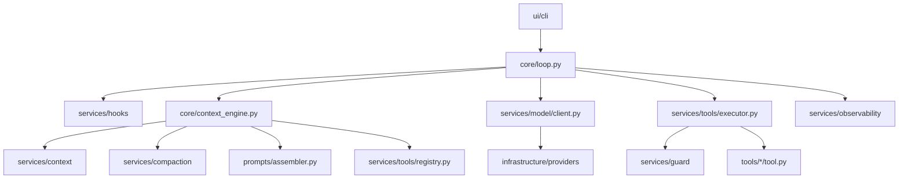

# OneCode 目标架构

本文描述 OneCode 的目标实现结构。它只定义未来架构边界、模块职责和依赖方向，不描述临时 demo 或历史实现。

## 架构目标

OneCode 是一个 code agent runtime。它的核心不是 CLI wrapper，而是围绕主循环、上下文重建、工具执行、hook、guard、动态 prompt、模型适配、压缩和可观测性组成的可演化系统。

目标架构需要满足几个要求：

- 主循环保持薄，只负责 agent 生命周期编排。
- 上下文重建是核心能力，由 `core/context_engine.py` 负责调度。
- `services/` 放实现 agent 能力所需的服务、抽象接口和通用运行时组件。
- 具体工具独立放在顶层 `tools/`，每个工具一个子目录。
- `prompts/` 独立负责动态 prompt 组装。
- `guard` 负责项目路径边界、路径解析和安全策略，不和 hook 混在一起。
- CLI 是 UI 的一种实现，放在 `ui/cli/`。
- 模型 provider、配置加载、文件系统适配等基础设施放在 `infrastructure/`。

## 目标目录结构

```text
OneCode/
  core/
    loop.py
    context_engine.py
    runtime_state.py
    transitions.py

  services/
    tools/
      registry.py
      executor.py
      schema.py
      types.py
    hooks/
      registry.py
      events.py
      builtin.py
    compaction/
      service.py
      transcript.py
      result_store.py
    context/
      snapshot.py
      message_store.py
      projector.py
    guard/
      resolver.py
      boundary.py
      policy.py
    model/
      client.py
      types.py
    observability/
      events.py
      trace.py

  prompts/
    assembler.py
    sections.py
    runtime_context.py

  tools/
    read_file/
      tool.py
      prompt.py
    write_file/
      tool.py
      prompt.py
    edit_file/
      tool.py
      prompt.py
    bash/
      tool.py
      prompt.py
    glob/
      tool.py
      prompt.py

  infrastructure/
    providers/
      chat_completions.py
    config/
      env.py
      project_config.py
    filesystem/
      paths.py

  ui/
    cli/
      app.py
      commands.py
      renderer.py
```

## 模块职责

### core/

`core/` 放 agent runtime 最关键的编排代码。

`core/loop.py` 是主循环。它接收用户输入，触发 hook，调用上下文重建引擎，调用模型，分发工具调用，处理停止条件和 transition。它不直接实现具体工具、具体 provider、路径判断、压缩细节或 prompt 文本。

`core/context_engine.py` 是上下文重建引擎。它负责把当前运行状态转换为一次模型调用所需的完整快照，包括模型可见消息、系统 prompt、工具 schema、压缩结果和 trace 信息。它可以编排 `services/context`、`services/compaction`、`services/tools` 和 `prompts`，但不持有具体策略细节。

`core/runtime_state.py` 保存会话运行状态，例如消息索引、turn count、usage、当前 transition、压缩状态、工具结果引用和 session metadata。

`core/transitions.py` 定义 runtime transition，例如 `tool_use`、`completed`、`rate_limit_retry`、`reactive_compact_retry`、`max_output_recovery`、`stop_hook_continue`、`max_turns`。transition 是可观测事件和测试断言的基础。

### services/

`services/` 放 agent 能力的服务层。这里可以包含抽象接口、通用实现和 runtime 服务，但不放具体业务工具。

#### services/tools/

工具服务负责工具注册、schema 生成、工具执行和结果归一化。

`registry.py` 管理当前启用的工具集合。模型可见工具必须从 registry 动态生成，不能在主循环中硬编码。

`executor.py` 执行模型请求的 tool calls。执行流程包括查找工具、校验输入、触发 `PreToolUse` hook、调用具体工具、处理异常、触发 `PostToolUse` hook，并把结果转换成模型可消费的 tool result。

`schema.py` 负责把内部工具描述转换为模型 provider 所需的 tool schema。

`types.py` 定义 `ToolDescriptor`、`ToolCall`、`ToolResult`、`ToolRuntime` 等公共结构。

具体工具不放在这里。`services/tools/` 是工具运行时，顶层 `tools/` 是工具实现。

#### services/hooks/

hook 服务负责 runtime 生命周期事件扩展。

`events.py` 定义稳定事件，例如 `UserPromptSubmit`、`PreToolUse`、`PostToolUse`、`ToolError`、`PreCompact`、`PostCompact`、`Stop`。

`registry.py` 管理 hook 注册、顺序执行、阻断结果和输入更新。

`builtin.py` 放默认 hook，例如工具日志、压缩日志、基础危险操作提醒等。

hook 是扩展点，不是安全边界的唯一来源。涉及路径边界和项目访问规则时，必须交给 `services/guard/` 做确定性判断。

#### services/compaction/

compaction 是具体服务，负责治理 agent 工作内存。

`service.py` 提供压缩入口，包括工具结果预算、旧工具结果清理、滑动窗口、主动 full compact 和 reactive compact。

`transcript.py` 负责会话 transcript 写入和 compact 前快照保存。

`result_store.py` 负责大工具结果持久化、预览生成和引用恢复。

compaction 不直接决定主循环是否继续。它向 `core/context_engine.py` 返回压缩后的上下文投影或状态更新。

#### services/context/

context 服务负责消息存储、模型可见上下文投影和快照结构。

`message_store.py` 管理会话消息、compact boundary、工具结果引用和历史恢复入口。

`projector.py` 把内部消息状态投影为模型调用所需的 message list。它可以隐藏、替换或引用过大的历史内容。

`snapshot.py` 定义 `ContextSnapshot`，包含 system prompt、messages、tool schemas、usage hints、transcript refs 和当前 transition。

`core/context_engine.py` 调用这些服务完成重建，但重建算法的生命周期位置属于 core。

#### services/guard/

guard 负责项目访问边界和安全策略。

`resolver.py` 负责把用户输入路径、工具参数路径和配置路径解析为规范化路径。

`boundary.py` 判断路径是否位于允许的项目边界内，处理符号链接、相对路径、跨平台路径表示和不存在目标的父目录判断。

`policy.py` 负责 allow、deny、ask 等策略决策。deny 必须优先于 allow 和 hook。

guard 与 hooks 的关系是：guard 做确定性安全判断，hook 做生命周期扩展和额外拦截。hook 不能覆盖 guard 的 deny 结果。

#### services/model/

模型服务定义 OneCode 内部的模型边界。

`client.py` 定义模型客户端协议，例如 `send()`、`summarize()` 和未来的 streaming 接口。

`types.py` 定义归一化响应结构，例如 `LLMResponse`、`ModelUsage`、`ProviderError`、`ToolCallBlock`。

`services/model/` 不放具体 provider 实现。具体 Chat Completions、Responses API 或其他 provider 适配放在 `infrastructure/providers/`。

#### services/observability/

可观测性服务负责结构化记录 runtime 决策。

`events.py` 定义 trace event，例如 `model_call_start`、`model_call_end`、`tool_use_start`、`tool_use_end`、`compact_start`、`compact_end`、`transition`。

`trace.py` 负责写入 JSONL trace 或提供给 UI 渲染。

可观测性不是 debug 文本。它应该成为 CLI、测试、回放和未来 UI 共享的事实来源。

### prompts/

`prompts/` 负责动态 prompt 组装。

`runtime_context.py` 定义 prompt 组装所需的输入，例如当前工作状态、工具 registry、guard 策略、compaction 状态、用户偏好和 UI 模式。

`sections.py` 放可组合 section，例如 identity、行为规则、工具策略、guard 策略、compaction 说明、上下文恢复说明。

`assembler.py` 根据 `PromptRuntimeContext` 生成最终 system prompt。

工具专属 prompt 不放在 `prompts/`，而是放在对应的 `tools/<tool_name>/prompt.py`。`prompts/assembler.py` 可以从工具 registry 读取工具 prompt 摘要，再决定是否注入。

### tools/

`tools/` 放具体工具实现。每个工具一个子目录，包含工具逻辑和工具专属 prompt。

`tool.py` 定义工具描述、输入 schema、元数据和 handler。

`prompt.py` 定义模型理解该工具所需的描述、使用约束和可选 few-shot 片段。

工具实现不应该直接修改主循环状态。工具只接收明确的 runtime 输入，返回结构化结果。路径类工具必须调用 `services/guard/` 或通过 `ToolRuntime` 间接使用 guard。

示例：

```text
tools/read_file/
  tool.py
  prompt.py
```

`tool.py` 提供读取文件能力，`prompt.py` 提供该工具对模型可见的使用说明。

### infrastructure/

`infrastructure/` 放基础设施适配。

`infrastructure/providers/chat_completions.py` 实现 Chat Completions 兼容 provider，把外部协议转换为 `services/model/types.py` 中的内部结构。

`infrastructure/config/env.py` 读取环境变量。

`infrastructure/config/project_config.py` 读取项目配置，例如默认模型、guard 策略、启用工具、UI 配置。

`infrastructure/filesystem/paths.py` 放跨平台路径处理的底层工具函数。更高层的边界判断仍属于 `services/guard/`。

基础设施可以被 services 调用，但不反向依赖 core。

### ui/

`ui/` 放用户界面。CLI 是 UI 的一种具体实现。

`ui/cli/app.py` 负责启动 CLI 应用、创建 runtime、进入交互循环。

`ui/cli/commands.py` 处理 `/tools`、`/compact`、`/clear`、`/exit` 等命令。

`ui/cli/renderer.py` 负责把模型输出、工具调用、trace event 和错误恢复状态渲染为终端文本。

UI 不直接实现 agent 逻辑。UI 调用 core，并订阅 services/observability 的事件来展示状态。

## 运行流程



每轮任务的执行顺序：

1. UI 接收用户输入。
2. `core/loop.py` 触发 `UserPromptSubmit` hook。
3. 用户输入进入 runtime state 和 message store。
4. `core/context_engine.py` 重建本轮 `ContextSnapshot`。
5. context engine 调用 compaction、context projector、prompt assembler 和 tool registry。
6. loop 使用 `services/model/client.py` 调用模型。
7. provider 返回被归一化的 `LLMResponse`。
8. 如果响应包含 tool calls，loop 交给 `services/tools/executor.py`。
9. executor 触发 hook，调用 guard，执行具体工具，并返回 tool results。
10. tool results 写回 message store，loop 进入下一轮。
11. 如果响应不包含 tool calls，loop 触发 `Stop` hook。
12. Stop hook 不要求继续时，UI 渲染最终结果。

## 依赖方向

依赖方向应保持单向：

```text
ui -> core -> services -> infrastructure
             services -> tools
             core -> prompts
```

约束：

- `tools/` 不能依赖 `core/`。
- `infrastructure/` 不能依赖 `core/`。
- `core/loop.py` 不能 import 具体工具目录。
- `core/loop.py` 不能 import 具体 provider。
- `prompts/` 可以读取工具 prompt 描述，但不能执行工具。
- `services/guard/` 的 deny 结果不能被 hook 覆盖。

## 主循环边界

主循环只做编排：

```text
receive prompt
emit UserPromptSubmit
append user message
while running:
  build ContextSnapshot
  call model
  append assistant message
  if tool calls:
    execute tools
    append tool results
    continue
  emit Stop
  return final answer
```

以下逻辑不进入主循环：

- 具体工具名判断。
- 具体路径解析规则。
- 具体 provider 协议字段。
- prompt section 文本。
- compact 策略细节。
- trace 文件格式。
- UI 渲染细节。

## guard 与 hook

guard 和 hook 都能阻止工具执行，但职责不同。

guard 是安全和项目边界：

- 路径是否越界。
- 命令是否命中 deny。
- 当前项目规则是否允许访问。
- 是否需要 ask。

hook 是生命周期扩展：

- 记录工具调用。
- 修改工具输入。
- 在工具前后补充审计。
- 在 compact 前后提取信息。
- 在 Stop 阶段决定是否继续。

当二者冲突时，guard 优先。尤其是 deny 结果不能被 hook、session allow 或模型请求覆盖。

## 工具组织

具体工具以目录为单元组织：

```text
tools/<tool_name>/
  tool.py
  prompt.py
```

每个工具至少提供：

- 名称。
- 描述。
- 输入 schema。
- 元数据，例如 read-only、是否修改文件系统、是否可并发、是否需要 guard。
- handler。
- prompt section 或 prompt descriptor。

工具注册时，`services/tools/registry.py` 读取这些描述。模型可见 schema 和 prompt 工具说明都从 registry 动态生成。

## 上下文与压缩

context 和 compaction 都是服务，但职责不同。

context 负责当前会话的消息结构和模型可见投影。

compaction 负责降低上下文体积，持久化大结果，生成 compact summary，并维护 transcript 引用。

`core/context_engine.py` 负责决定每轮模型调用前如何组合这些服务：

1. 从 message store 读取当前会话消息。
2. 让 compaction service 处理大结果、旧结果和 compact boundary。
3. 让 context projector 生成模型可见 messages。
4. 让 prompt assembler 生成 system prompt。
5. 从 tool registry 获取当前工具 schema。
6. 返回 `ContextSnapshot`。

## 模型边界

模型 provider 必须被隔离在 infrastructure 中。

core 和 services 只理解内部结构：

- `LLMResponse`
- `ToolCall`
- `ModelUsage`
- `ProviderError`
- `OutputInterrupted`
- `ContextLimitExceeded`

provider-specific 字段只能在 `infrastructure/providers/` 内解析。未来切换 provider、支持 streaming 或增加 fallback model，不应修改主循环。

## UI 边界

CLI 是 UI，不是 runtime。

CLI 可以提供：

- 交互输入。
- 单 prompt 执行。
- 工具列表查看。
- 手动 compact。
- 会话清理。
- trace 和 transition 展示。

CLI 不应该直接执行工具、拼 prompt、判断路径权限或处理 provider 协议。

