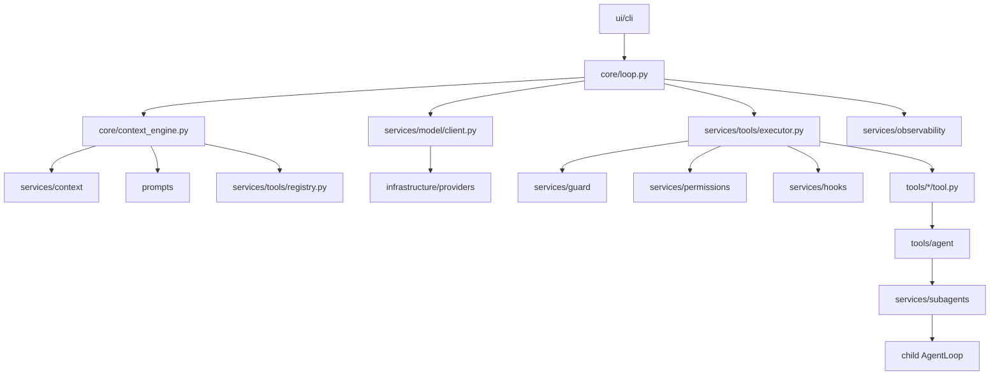

# OneCode 架构

本文是 OneCode 的根架构说明，只保留系统级架构、核心抽象、依赖方向和运行流程。各模块的职责、当前实现细节和后续边界说明放在 `docs/design-docs/` 的模块架构文档中。

## 项目定位

OneCode 是一个 Python code agent runtime。它的核心不是 CLI wrapper，而是围绕 agent 主循环、上下文重建、工具执行、安全边界、动态 prompt、模型适配、会话记录和可观测性组成的可演化运行时。

架构目标：

- 主循环保持薄，只负责编排 agent 生命周期。
- 上下文、prompt、工具 schema 每轮由运行时状态动态重建。
- 工具通过 registry、descriptor、classifier 和 executor 接入，不在主循环硬编码工具名。
- 路径边界、权限判断和 hook 扩展分层处理，deny 结果不能被 hook、用户确认或 session allow 覆盖。
- 模型 provider 隔离在 infrastructure 中，core 只依赖 provider-neutral 协议。
- CLI 是 UI 的一种实现，不直接承载 agent runtime 逻辑。
- transcript、trace 和未来 compaction/result store 是上下文治理和恢复能力的基础设施。

## 当前模块地图

```text
OneCode/
  core/
    loop.py
    context_engine.py
    runtime_state.py
    stream_events.py
    transitions.py

  services/
    context/
    guard/
    hooks/
    model/
    observability/
    permissions/
    subagents/
    tools/

  prompts/
    assembler.py
    cache.py
    runtime_context.py
    sections.py

  tools/
    agent/
    bash/
    edit_file/
    glob/
    grep/
    read_file/

  infrastructure/
    config/
    filesystem/
    providers/

  ui/
    cli/
```

仍属于目标架构但尚未落地为完整模块的能力包括：`services/compaction/`、`services/context/projector.py`、通用 durable result store、恢复类 transition 流程、完整 provider recovery UI、background subagent 和自定义 agent 加载。

## 模块文档索引

- `docs/design-docs/core-runtime-architecture.md`：`core/` 的主循环、上下文引擎、状态和 transition。
- `docs/design-docs/tools-runtime-architecture.md`：`services/tools/` 的 registry、descriptor、schema、executor、并发和结果预算。
- `docs/design-docs/context-and-prompt-architecture.md`：`services/context/`、目标 compaction/projector 和 `prompts/`。
- `docs/design-docs/safety-and-extension-architecture.md`：`services/guard/`、`services/permissions/` 和 `services/hooks/`。
- `docs/design-docs/model-and-infrastructure-architecture.md`：`services/model/` 与 `infrastructure/`。
- `docs/design-docs/concrete-tools-architecture.md`：顶层 `tools/` 下各具体工具的职责。
- `docs/design-docs/subagents-architecture.md`：`services/subagents/` 与 `tools/agent/`。
- `docs/design-docs/observability-and-cli-architecture.md`：`services/observability/` 与 `ui/cli/`。

这些模块文档描述当前代码职责和局部架构。根文档优先用于判断跨模块归属、依赖方向和核心抽象。

## 核心抽象

`AgentLoop` 是薄主循环。它接收用户输入或继续已有消息链，调用 `ContextEngine` 构建 `ContextSnapshot`，通过 `ModelClient` 消费 provider-neutral stream event，必要时调用 `ToolExecutor` 执行工具，并把 assistant message 与 tool result 写回 `MessageStore`。

`RuntimeState` 保存单个会话的运行状态，包括 usage、turn count、max turns、session id、last transition 和 metadata。metadata 可承载运行期事实，例如已读文件、隐藏工具、只读 subagent 标记和 fork child 标记。

`ContextEngine` 是每轮模型调用前的上下文重建边界。它读取 `MessageStore`，调用可注入的 context preparer、prompt assembler 和 tool schema provider，返回 `ContextSnapshot`。

`ContextSnapshot` 是 provider 调用前的模型可见快照，包含 system prompt、messages、tool schemas、usage hints、transcript refs 和当前 transition。

`MessageStore` 是内存优先的 session message store，并通过 `JsonlTranscriptStore` 写入 `.onecode/<session_id>/messages.jsonl`。OneCode 内部使用 `role="tool_result"` 保存工具结果，provider adapter 负责投影成目标 wire format。

`ModelClient` 是 provider-neutral 模型协议。当前模型客户端通过 `stream(snapshot)` 产出 `ModelStreamEvent`，包括文本 delta、工具调用 delta、完成的工具调用、完整 assistant message、usage 和错误。

`ToolDescriptor` 是工具事实来源，定义名称、描述、输入 schema、输出 schema、工具 prompt、search hint、输入校验、input-aware classifier 和 handler。

`ToolCallClassification` 描述一次工具调用的运行时属性，包括是否只读、是否修改文件系统、是否可并发、触达的 `ToolTarget`、结果预算策略和权限审计 subject。

`ToolRegistry` 管理当前启用的工具集合，并从同一个可见工具视图生成 provider tool schema 和 prompt 工具说明。被 disabled、denied 或 permission policy 隐藏的工具不会进入模型可见能力。

`RegistryToolExecutor` 是工具执行入口。它按 descriptor 查找工具、校验输入、分类调用、执行 guard 和 permission policy、运行 hook、调用 handler、应用 result policy，并输出统一 `ToolExecutionResult`。

`SandboxGuard` 和 `PermissionPolicy` 共同构成工具执行前的安全边界。guard 负责确定性路径分类，permission policy 负责 deny-first 合并工具级规则、guard 结果、危险目录、可疑路径、session 临时授权和 UI 用户确认。

`HookRegistry` 是生命周期扩展点。当前稳定事件覆盖工具阶段的 `PreToolUse`、`PostToolUse` 和 `ToolError`；未来事件可覆盖 user prompt、compact 和 stop 阶段。hook 不能绕过 guard deny。

`TraceRecorder` 是结构化可观测性入口。loop、executor、hook 和 subagent runner 通过它写入 span/event，JSONL sink 是当前 CLI 和测试共享的事实来源。

## 运行流程



当前每轮执行顺序：

1. UI 或调用方把用户输入交给 `AgentLoop.stream(prompt)`；子 agent 可以通过 `continue_stream()` 从已 seed 的消息链继续。
2. loop 将用户消息追加到 `MessageStore`，并发布 interaction 事件。
3. loop 递增 turn count；超过 `max_turns` 时设置 `max_turns` transition 并停止。
4. `ContextEngine` 重建 `ContextSnapshot`：读取消息、准备上下文、组装 system prompt、获取当前可见工具 schema。
5. loop 调用 `ModelClient.stream(snapshot)`，向 UI 透出 assistant delta 和 tool call ready 事件。
6. provider adapter 归一化完整 assistant message、final text、tool calls、usage 和 stop reason。
7. loop 写入 assistant message；如果存在实际 tool calls，就交给 `RegistryToolExecutor`。
8. executor 执行工具 preflight、guard、permission、hook、handler、结果预算和 trace，返回工具结果。
9. loop 将 tool results 写回 `MessageStore`，设置 `tool_use` transition，并进入下一轮。
10. 如果没有 tool calls，loop 设置 `completed` transition，返回最终文本。

## 依赖方向

依赖方向必须保持核心与具体实现解耦：

```text
ui / application composition -> core
core -> services contracts
core -> prompts protocol
tools -> services.tools types / ToolRuntime
infrastructure.providers -> services.model/context/tools types
services.guard -> infrastructure.filesystem
```

约束：

- `core/loop.py` 不能 import 具体工具目录。
- `core/loop.py` 不能 import 具体 provider。
- `services/tools/` 不能静态 import 顶层 `tools/<tool_name>/`。
- `tools/` 可以依赖 `services.tools` 公共类型和 `ToolRuntime`，但不能依赖 `core/loop.py`。
- `infrastructure/` 不能依赖 `core/`。
- `prompts/` 可以读取工具 descriptor 中的 prompt 文本，但不能执行工具。
- `services/guard/` 的 deny 结果不能被 hook、session allow、permission prompter 或模型请求覆盖。

## 主循环边界

主循环只表达 agent 生命周期编排：

```text
receive prompt
append user message
while running:
  increment turn count
  stop if max_turns exceeded
  build ContextSnapshot
  call model stream
  append assistant message
  if actual tool calls:
    execute tools
    append tool results
    set tool_use transition
    continue
  set completed transition
  return final answer
```

以下逻辑不进入主循环：

- 具体工具名判断。
- 具体 provider wire 字段。
- 具体路径解析和 sandbox 规则。
- prompt section 文本。
- 权限 UI 展示。
- 工具结果持久化策略细节。
- trace 文件格式。
- CLI slash command 和渲染细节。

## 安全与扩展原则

OneCode 的安全边界由代码路径保证，不依赖模型自觉。路径解析、guard、permission policy、工具级输入校验和 handler 兜底检查共同组成执行前安全链路。

deny 是最高优先级。任何有效 deny 都应同时影响模型可见能力和执行入口；hook、用户确认、session allow 和历史消息中的旧工具调用都不能覆盖 deny。

hook 是扩展点，不是安全边界的替代品。hook 可以阻断、记录、更新输入或补充 metadata；hook 更新输入后必须重新经过 schema validation、工具 validation、classification、guard 和 permission policy。

## 上下文治理原则

上下文是 agent 的受管理工作内存，不是无限聊天记录。当前实现已经有内存消息链、JSONL transcript 和大工具结果外置到 transcript 附件的基础能力；完整目标还包括 context projector、compaction service、durable result store、compact summary 和 reactive compact retry。

这些治理能力应由 `ContextEngine` 编排，并通过 `ContextSnapshot` 交给 provider，不应进入 `AgentLoop` 的具体分支。
