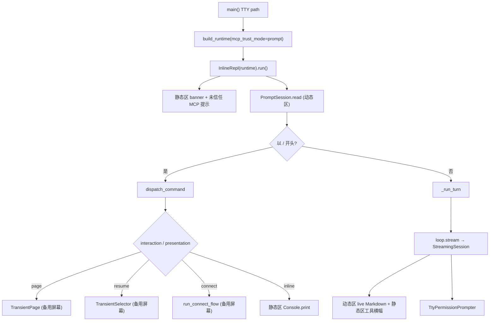

# CLI Architecture

本文描述 `ui/cli/` 的架构。CLI 是 OneCode 当前的增强 REPL 界面，负责应用装配、交互输入、命令处理、附件收集、权限提示和终端渲染，但不实现 agent 主循环、工具执行、安全策略或 provider 协议。

启动：`uv run python -m ui.cli.app`（TTY 时启动内联终端 REPL；stdin 非 TTY 时走 batch 路径）。

TTY 路径采用 **内联终端渲染模型**（与 Claude Code / Ink 的 Static + dynamic 分层同类，基于 `prompt_toolkit` + Rich）：定稿内容打印进终端正常缓冲区（继承终端明暗背景、可向上滚动回看）；底部输入框、流式预览、斜杠补全画在可擦除的动态区；`/status`、`/resume` 等临时界面进入备用屏幕（DEC 1049），退出后主屏幕恢复且临时内容不进入 scrollback。

## 文件职责

| 文件 | 职责 |
|:---|:---|
| `app.py` | `build_runtime()` 依赖装配、`main()` 入口分流、MCP trust/skip 处理、长期记忆 dream 钩子 |
| `batch.py` | 非交互 batch：读 stdin 一行、`loop.stream()` 流式打印到 stdout |
| `input.py` | `read_batch_line()`、fallback `read_confirm_sync()`（MCP trust / batch 权限） |
| `terminal/` | 内联终端 REPL：`InlineRepl` 主循环、静态/动态区渲染、备用屏幕临时界面（见下表） |
| `commands.py` | `CommandSpec` 注册表、slash command 解析与 `dispatch_command()` 分发 |
| `suggestions.py` | `/` 命令、`/resume` 参数、`@file` 内联补全数据 |
| `resume.py` | session summary 扫描、标题派生、transcript target 解析和恢复 helper |
| `connect.py` | `write_provider_env()`、provider 选项列举 |
| `theme.py` | Rich style 名称（前景色，永不设背景）、light/dark 主题选择、Unicode 状态符号 |
| `renderer.py` | Rich renderable 工厂、batch 路径 `print_renderable()` |
| `tool_renderers.py` | 工具结果 1 行摘要 |
| `views/` | 用户可见 Rich 状态视图 |
| `permissions.py` | 权限面板文本渲染（`render_permission_panel`）与 batch fallback prompter |
| `types.py` | `CliRuntime`、`CommandResult` |

### `terminal/` 子模块

| 文件 | 职责 |
|:---|:---|
| `repl.py` | `InlineRepl` 主循环：装配、读输入、dispatch、`run_agent`、shutdown |
| `detect.py` | 终端背景明暗探测（OSC 11 → COLORFGBG → dark） |
| `static_output.py` | 静态区打印：反色用户行、`onecode>` 前缀、工具横幅/结果、未信任 MCP 提示 |
| `prompt_session.py` | 动态区输入框：上下边框、`/`/`@` 补全菜单、Enter/Tab 语义 |
| `completer.py` | `suggestions_for` → prompt_toolkit `Completer` 适配 |
| `queue.py` | agent 运行中输入队列（FIFO） |
| `stream_session.py` | 流式动态区：live Markdown 预览（ANSI 节流重绘）、Esc 取消、工具事件写静态区 |
| `transient.py` | DEC 1049 备用屏幕生命周期 + `can_enter_alternate_screen` 能力守卫 |
| `page.py` | 备用屏幕分页查看 renderable（`/status` 等），Esc 返回 |
| `selector.py` | 备用屏幕列表选择（`/resume`） |
| `connect_flow.py` | `/connect` 多步向导（备用屏幕） |
| `permission_prompt.py` | TTY 权限确认（备用屏幕或流式中 `run_in_terminal` 回退） |
| `trust_prompt.py` | MCP trust 启动期确认 |

## 入口分流

- **TTY**：`main()` 先构建 `CliRuntime`，使用 `mcp_trust_mode="prompt"` 在启动期询问未信任项目 stdio MCP server 的信任（通过 `trust_prompt` 回调），再运行 `InlineRepl(runtime).run()`。`InlineRepl` 打印 banner，提示被跳过的 MCP server，进入主循环。
- **非 TTY**：`batch.run_batch(workspace)`，不启动 prompt_toolkit；MCP trust 与权限 fallback 使用 stdin `read_confirm_sync()`。

## 内联布局（`terminal/`）

- **静态区**（终端 scrollback，`static_output.py`）：banner、反色 `>` 用户行、`onecode>` 助手前缀 + Markdown 定稿、工具横幅与结果摘要。用绑定 `sys.stdout` 的 Rich `Console` 打印，**不设 background**，背景由终端宿主提供。
- **动态区**（`prompt_session.py` / `stream_session.py`）：非全屏 `prompt_toolkit.Application(full_screen=False, erase_when_done=True)`。空闲时是带上下 `─` 边框的输入框；agent 运行时是 live Markdown 流式预览 + 状态行。阶段结束时动态区自擦除，不污染 scrollback。
- **备用屏幕**（`transient.py` 等）：全屏临时界面用 `prompt_toolkit` `full_screen=True`（其自身管理 DEC 1049）。`transient.py` 暴露 `can_enter_alternate_screen()` 作为 TTY 能力守卫，以及直接渲染 Rich 时可用的 `transient_terminal_scope()` 上下文。

## 接口设计

### build_runtime

```python
build_runtime(
    workspace,
    *,
    trust_prompt: Callable[[McpTrustPromptRequest], "trust"|"skip"] | None = None,
    permission_prompter: PermissionPrompter | None = None,
    mcp_trust_mode: Literal["prompt", "skip"] = "prompt",
) -> CliRuntime
```

`mcp_trust_mode="prompt"` 时，未信任项目 stdio MCP server 使用 `trust_prompt` 或 stdout + `read_confirm_sync()` 询问用户。内联 TTY 路径使用 `mcp_trust_mode="prompt"`（不再像旧路径那样默认 skip）。未信任 server 摘要写入 `RuntimeState.metadata["mcp_untrusted_servers"]`，随后由 `McpConnectionManager` fail closed 标记为 `untrusted`。batch 路径仍可显式传 `mcp_trust_mode="skip"`。

### 主对话流

`InlineRepl._run_turn()` 把 `runtime.loop.stream()` 事件交给 `stream_session.StreamingSession`，由其拥有动态区预览与 Esc 取消：

| 事件 | UI 行为 |
|:---|:---|
| `assistant_delta` | 累加 buffer → 动态区 live Markdown 预览（50ms 节流，ANSI 渲染） |
| `tool_call_ready` / `tool_started` / `tool_progress` | 工具横幅写入静态区；动态区状态行显示 `tool: <name>` |
| `tool_result` | 结果摘要写入静态区 |
| `completed` | buffer 定稿为 Markdown 打印进静态区 |
| `error` | 红色错误块 + error log |

完成后动态区擦除，最终 Markdown 留在 scrollback。Esc 设置取消标志、退出预览 app，静态区打印「已取消」。

权限确认不走事件流，由 `permission_prompt.TtyPermissionPrompter` 在工具执行链中 `await request_permission()`。当流式预览 app 正在运行时，权限提示用 `prompt_toolkit.run_in_terminal` 临时挂起预览并以纯 confirm 询问，避免嵌套两个全屏 app。

### Command Registry

`dispatch_command(runtime, line) -> CommandResult` 行为不变。`InlineRepl` 层处理：

- `presentation="page"` → `terminal.page.TransientPage`（备用屏幕，Esc 返回）
- `presentation="inline"` → 静态区 `Console.print`
- `interaction="resume_selector"` → `terminal.selector.TransientSelector` + `restore_runtime_from_target`
- `interaction="connect"` → `terminal.connect_flow.run_connect_flow` + `write_provider_env` + `with_model_config`
- `should_exit` → flush + 退出循环

## 核心数据流



## 关键机制

### 终端主题

`detect.detect_terminal_brightness()` 探测宿主明暗（OSC 11 查询 → `COLORFGBG` → 暗色回退）。`theme.rich_theme_for(brightness)` 选择 light/dark Rich 主题；两份主题都只定义前景色，**永不设 background**，背景始终由终端提供。反色用户行在暗色用 `white on black`、亮色用 `black on white`。

### 补全与输入语义

`suggestions.py` 的 `suggestions_for(runtime, text, cursor)` 经 `completer.InlineCompleter` 接入 prompt_toolkit。菜单打开时：↑↓ 移动选中项；**Enter 采纳并提交**选中项（无选中则提交字面文本）；**Tab 仅将选中项填入输入框、不提交**。agent 运行中输入进入 `queue.InputQueue`，当前轮结束后按 FIFO 依次执行。

### Connect

`/connect` 由 `connect_flow.run_connect_flow` 多步向导完成：备用屏幕里选 provider → 输入 model / API key（必要时 base URL）→ `write_provider_env()` 只更新四个 `ONECODE_*` 键 → `with_model_config()` 重建模型客户端。

### 权限

TTY：`TtyPermissionPrompter` 备用屏幕确认；流式预览运行中用 `run_in_terminal` 纯 confirm 回退。非 TTY / 无备用屏幕：`render_permission_panel` + stdin `read_confirm_sync`。两条路径产生相同的 `PermissionResponse` 形状。

### 错误处理

`_run_turn` 异常写 `source=cli_main_loop`；退出时 flush transcript/trace/errors 并关闭 MCP。

## 当前限制

batch 路径仍为单行 stdin、纯文本 stdout，无 Markdown 渲染。动态区 live Markdown 预览有界高度（仅显示尾部若干行），完整内容在轮结束时定稿到静态区。流式过程中真正的按键级 Esc 取消依赖动态区预览 app 持有输入焦点。尚缺更细粒度 provider recovery UI 和 connect 后的在线模型目录浏览。
