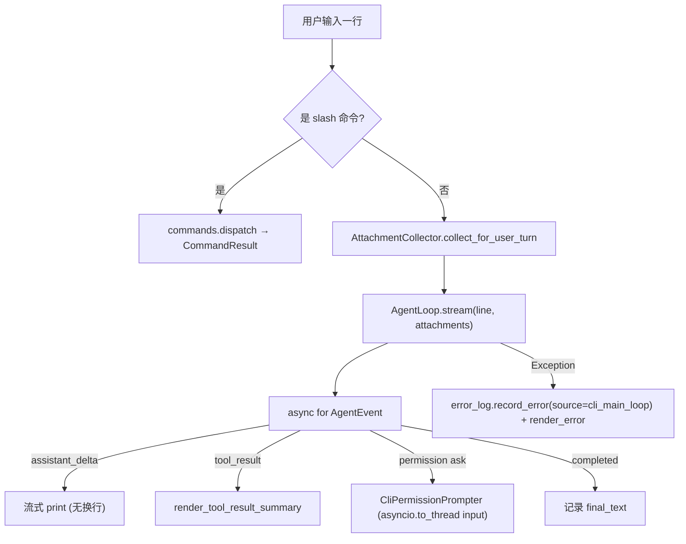

# CLI Architecture

本文描述 `ui/cli/` 的架构。CLI 是 OneCode 当前的标准库交互界面，负责应用装配、交互输入、命令处理、附件收集、权限提示和终端渲染，但不实现 agent 主循环、工具执行、安全策略或 provider 协议。

启动：`uv run python -m ui.cli.app`。

## 文件职责

| 文件 | 职责 |
|:---|:---|
| `app.py` | `build_runtime()` 依赖装配、`main_loop_async()` 主循环、长期记忆 dream 钩子 |
| `commands.py` | slash 命令分发、`/clear`、`/resume` 会话切换 |
| `renderer.py` | 纯文本渲染（banner、status、trace、工具结果摘要等） |
| `permissions.py` | `CliPermissionPrompter` 交互式权限面板 |
| `types.py` | `CliRuntime` 运行时容器、`with_session()`、`CommandResult` |

## 接口设计

### build_runtime

`build_runtime(workspace) -> CliRuntime` 是唯一应用装配入口。它按依赖顺序创建所有 runtime 组件并聚合到 `CliRuntime`。装配分组（按创建先后）：

1. 基础状态：`RuntimeState`、`MessageStore`。
2. 权限：`SessionPermissionStore`、`ProjectPermissionSettingsStore`、`PermissionPolicy`。
3. 可观测性：`JsonlTraceSink` + `TraceRecorder`、`JsonlErrorLogSink` + `ErrorLogRecorder`。
4. MCP：`load_project_mcp_config` → stdio server trust prompt/skip → `McpConnectionManager.connect_all_blocking()` → `mcp_server_instructions` → `build_mcp_tool_descriptors`。
5. Hooks 与任务：`HookRegistry`、`TaskStore`、`BackgroundTaskManager`。
6. base descriptors：`read_file`、`edit_file`、`write_file`、`glob`、`grep`、`bash`、`background_task_stop`、`skill`、`task_create/get/update/list`、`*mcp_descriptors`。
7. registry 与存储：`ToolRegistry`、`ToolResultStorage`、`SessionMemoryStore`、`LongTermMemoryStore`。
8. prompt 与记忆：`LoaderSkillCatalogProvider`、`InstructionMemoryLoader`、`LongTermMemoryPromptProvider`、`DynamicPromptAssembler`。
9. compaction：`ContextCompactionService`。
10. 沙箱/权限 UI/附件：`SandboxGuard(SandboxBoundary(cwd=workspace))`、`CliPermissionPrompter`、`FileStateCache`、`AttachmentFileReader`、`AttachmentCollector`（含 `BackgroundTaskNotificationSource`）。
11. 模型与上下文：`CurrentModelContext`、`create_model_client(.env)`、`RelevantMemorySelector`、`ContextEngine`（preparer 链 `AttachmentContextPreparer(RelevantMemoryContextPreparer(compaction))`）。
12. subagent：`SubagentRunner`、`SessionMemoryExtractionService`、`LongTermMemoryExtractionService`。
13. hook 回调：`TURN_STOPPED → _start_long_term_memory_dream`。
14. `compaction_service.bind_runtime(...)`。
15. 工具注册与执行器：注册 `agent` descriptor、`RegistryToolExecutor`。
16. `AgentLoop`。

`agent` descriptor 在 `SubagentRunner` 创建后才注册，不在初批 base descriptors 中。

### CliRuntime

聚合 30+ 组件，供 slash command 和 render 层使用。`with_session()` 在 `/clear`/`/resume` 时重建 session 级组件（recorder 切换、清空 `SessionPermissionStore`、重建 `ToolResultStorage`/`SessionMemoryStore`/`FileStateCache`/`AttachmentCollector`/`ContextEngine`/`AgentLoop`/`SessionMemoryExtractionService`，并设置 session memory resume 标记）。

## 核心数据流

## 关键机制

### slash 命令

| 命令 | 行为 |
|:---|:---|
| `/help` | 命令列表 |
| `/tools` | registry 全部 descriptor |
| `/tasks` | 当前 task list（过滤 `_internal`） |
| `/background-tasks` | 进程内后台任务（最近 20） |
| `/mcp [tools]` | MCP server 状态（含 untrusted/disabled/failed）；`tools` 列出发现的工具 |
| `/status` | usage、transcript/trace/errors 路径、MCP、后台任务、长期记忆、compaction 状态 |
| `/history [n]` | 最近 n 条消息摘要（默认 20） |
| `/trace [n]` | 最近 n 条 trace（默认 20，读 `trace.jsonl`） |
| `/compact [focus]` | 手动 `manual_compact`，可选 focus |
| `/resume <target>` | 从 session id 或 `messages.jsonl` 恢复 |
| `/clear` | 新 session（旧 transcript 保留），重建 session 组件 |
| `/exit`、`/quit` | flush transcript/trace/errors，关闭 MCP，退出 |

未知命令 → `Unknown command: {cmd}. Use /help.`。当前无 `/memory`（长期记忆状态在 `/status` 展示）。

### streaming 渲染

`assistant_delta` 无换行流式打印；`tool_result` 打印 `[tool_name call_id ok/error]` 摘要；无 delta 时回退非流式 `render_assistant`。`tool_started`/`tool_progress` 当前不渲染。

### 权限交互

`CliPermissionPrompter.request_permission()` 用 `asyncio.to_thread(input, ...)`，按工具类型渲染专用面板。响应映射：`y/yes` allow once，`s/session` allow session，`p/project`（仅 bash）写 project rule，其它 deny；EOF/中断视为 deny。附件读取复用同一 prompter。

### 附件收集与后台通知

每轮用户输入后、`stream()` 前收集 `@mention`、`BackgroundTaskNotificationSource` 通知和（主线程）文件变更（见 `attachment-architecture.md`、`background-task-architecture.md`）。

### 错误处理

主循环 `Exception` 先写 error log（`source="cli_main_loop"`）再渲染简短错误；`/exit` 与 EOF flush transcript/trace/errors 并关闭 MCP。

## 当前限制

`plan_mode` 仅为 attachment projector 预留，CLI/runtime 未主动注入；尚缺 provider connect/model selection flow、实时 trace 订阅 UI、更细粒度 provider recovery UI。这些应在对应 runtime service 落地后接入，而不是由 CLI 直接实现 provider-specific 或 recovery-specific 分支。
