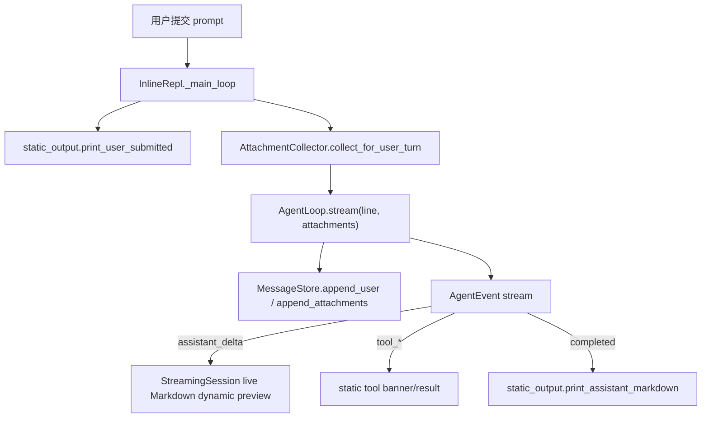

# CLI Message Rendering Architecture

本文记录当前 CLI 如何把会话消息、模型流式输出、工具调用和恢复历史渲染到终端界面。它只描述现有实现，不定义新的 UI 目标。

## 边界定位

CLI 主界面不是以 `messages.map(renderMessage)` 的方式每轮重绘整个 message 数组。正常对话时，`MessageStore` 是模型上下文和 transcript 的事实来源；终端输出由 `AgentLoop.stream()` 产出的事件驱动。

TTY 路径入口是 `ui/cli/app.py::main()` 创建 `CliRuntime` 后运行 `ui/cli/terminal/repl.py::InlineRepl`。非 TTY 路径仍由 `ui/cli/batch.py` 消费同一事件流并打印到 stdout。

## 输出区域

当前 TTY UI 分成三类区域：

- 静态区：`ui/cli/terminal/static_output.py` 使用 Rich `Console` 直接写 stdout。banner、反色用户行、assistant 定稿 Markdown、工具横幅和工具结果摘要会进入终端 scrollback。
- 动态区：`ui/cli/terminal/prompt_session.py` 和 `ui/cli/terminal/stream_session.py` 使用非全屏 `prompt_toolkit.Application(..., erase_when_done=True)`。输入框、补全菜单和 live Markdown 预览会在阶段结束时擦除。
- 备用屏幕：`ui/cli/terminal/page.py`、`selector.py`、`connect_flow.py` 和 `permission_prompt.py` 用临时全屏界面处理 page、选择器、connect 和权限确认；退出后不把临时正文写入主 scrollback。

## 正常对话渲染流

普通用户输入的显示路径如下：

`InlineRepl._run_turn()` 将 agent event async iterator 交给 `StreamingSession.run()`。`assistant_delta` 会累加到 `StreamBuffer.text` 并被动态区节流渲染。`completed` 如果携带完整文本且此前没有 delta，会作为 fallback 写入 buffer。轮次结束后，`commit_final()` 调用 `print_assistant_markdown()`，把最终 Markdown 打印进静态区。

因此，正常对话中屏幕上的流式 assistant 文本来自 runtime event；定稿文本来自同一个事件 buffer，而不是从已经持久化的 assistant message 重新读取。

## 工具调用渲染流

工具事件仍来自 `core/stream_events.py` 的 `AgentEvent`，当前 TTY 主屏会显示工具生命周期，而不是只显示最终结果：

- `tool_call_ready`：从 `event.metadata["tool_call"]` 取工具名、call id 和输入预览，调用 `print_tool_banner_start()` 写入静态区。
- `tool_started` / `tool_progress`：调用 `print_tool_banner_running()` 更新工具运行提示，并让动态区状态行显示当前工具名。
- `tool_result`：调用 `print_tool_result()`，再委托 `renderer.render_tool_result_summary()` 和 `ui/cli/tool_renderers.py` 输出一行结果摘要。

工具结果摘要只消费 `ToolExecutionResult` 的公共字段和 metadata，不读取文件、不执行工具，也不导入 `tools/*` handler。未覆盖的工具继续走 fallback 摘要，服务 MCP、插件或未来新工具。

工具执行完成后，loop 会把结果追加回 `MessageStore`，作为内部 `role="tool_result"` message；如果工具结果带有 followup attachment，loop 还会追加 attachment message。UI 的静态摘要只是展示，不是上下文事实来源。

## 权限 UI

权限确认不走普通 `AgentEvent` 渲染，而是在工具 executor preflight 中等待 `runtime.permission_prompter.request_permission(request)`。

TTY 路径使用 `ui/cli/terminal/permission_prompt.py::TtyPermissionPrompter`。如果当前存在运行中的 prompt_toolkit preview app，它通过 `run_in_terminal` 临时挂起动态区并用阻塞确认避免嵌套应用；否则使用备用屏幕或普通确认界面。非 TTY 路径继续使用 `ui/cli/permissions.py::CliPermissionPrompter` 的 stdin/stdout fallback。

权限面板内容仍由 `ui/cli/permissions.py::render_permission_panel()` 生成，权限策略和 guard 判断仍属于 services 层。

## 恢复历史渲染

`/resume` 有两种展示路径：

- 带 target 的 `/resume <id>` 由 `dispatch_command()` 直接恢复 runtime，并返回 `renderer.render_resume()` 与 `renderer.render_restored_messages()` 组成的 renderable。
- 无参数 `/resume` 由 `InlineRepl._run_resume_selector()` 打开 `TransientSelector`。选中后调用 `restore_runtime_from_target()`，再用 `render_restored_messages()` 生成恢复摘要 page。

恢复历史 page 是临时界面，Esc 退出后不把整段历史复制进主 scrollback。当前 scrollback 只保留恢复确认、后续用户输入、assistant 定稿和工具摘要。

`render_restored_messages()` 的规则是摘要级别：user 显示为反色 `> <preview>`；assistant 工具调用显示 `<tool call: ...>`；tool result 显示 `[tool_name call_id ok/error]`；attachment 显示简短附件摘要。

## 兼容历史视图

`renderer.render_history()` 仍存在，用表格显示 `role/detail`。它主要服务测试和诊断视图，不是普通主屏或 `/resume` 的主要路径。

## 设计约束

- CLI 主界面消费 `AgentEvent` 和 renderer helper，不依赖 provider wire format。
- UI 不能解析完整工具 stdout/stderr 来判断成功或失败；工具结果状态来自 `ToolExecutionResult.is_error`。
- 工具开始、进度和结果展示应继续消费现有 `tool_call_ready`、`tool_started`、`tool_progress`、`tool_result` 事件，不从 message 数组反推正在执行的工具。
- 权限面板由 permission prompter 负责，不能被 `/permissions` 只读视图或普通 tool result 摘要替代。
- 静态区展示不是上下文事实来源；`MessageStore`、transcript 和 tool result store 才是模型上下文与恢复依据。
