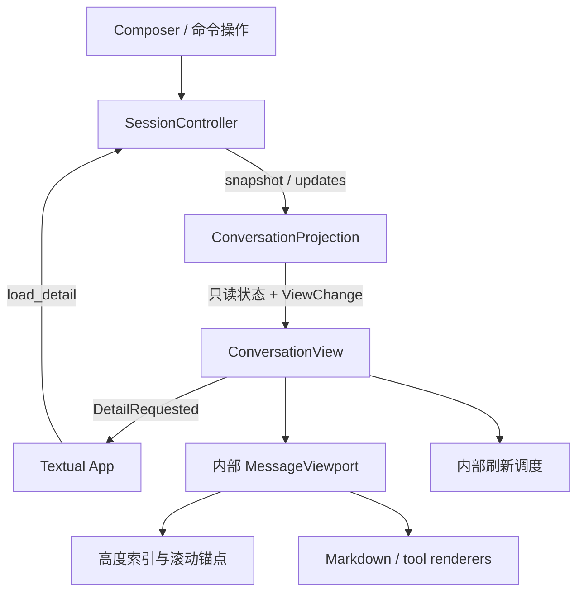

# ConversationView Architecture

状态：目标设计，设计决策已确认，尚未实现。目标 TTY 采用参考代码的 Textual 全屏 TUI；当前内联终端实现仍见 [CLI Architecture](cli-architecture.md)。

相关文档：[根架构](../../architecture.md)、[SessionController](session-controller-architecture.md)、[ConversationProjection](conversation-projection-architecture.md)、[参考 UI](../../reference/ui/)。

## 定位与职责

ConversationView 是全屏 TUI 的对话展示 Module。它接收只读消息投影及变化集，隐藏虚拟视口、滚动锚点、Markdown 缓存、工具详情展开和刷新调度。

ConversationView 不包含 runtime 装配、输入队列、命令业务、权限判断或 transcript 读取。Textual App 负责将 Composer、状态栏、Modal 与对话 View 装配起来，并在 Controller 和 Projection 之间转交操作及更新。

已确认的终端模型：

- TTY 主界面完整使用 Textual 管理屏幕及聊天历史滚动。
- 退出应用恢复原终端，不把整段聊天重新打印到原生 scrollback。
- 非 TTY batch 保留文本输入输出，不创建 Textual 应用。
- 查看历史、展开工具和回到最新位置都在 TUI 内完成。会话内容的导出属于独立命令能力，不需要另一条静态打印管线。

## 参考实现与目标结构

```text
ui/tui/
  app.py
  projection.py
  conversation/
    view.py                # ConversationView 的公开入口
    viewport.py            # MessageViewport / MessageWidget
    layout_index.py         # VirtualLayoutIndex
    render_cache.py         # MarkdownBlockCache
    refresh_scheduler.py   # UiRefreshScheduler
  renderers/
    message.py
    tool.py
    status.py
  composer/                # 输入与补全，属于 App 装配的相邻 Module
  modals/                  # 权限、问答、连接、会话选择等
  theme.py
  onecode.tcss
```

具体文件数量可按实现规模调整。`layout_index`、cache 和 scheduler 是 View 的内部实现，App 不需要逐个控制它们。

| 参考文件 | 移植内容及适配要求 |
|:---|:---|
| [viewport.py](../../reference/ui/viewport.py) | 可见区挂载、上下 spacer、测量与锚点恢复、详情展开、新内容提示 |
| [layout_index.py](../../reference/ui/layout_index.py) | 估算高度、前缀高度及可见范围定位 |
| [render_cache.py](../../reference/ui/render_cache.py) | 已闭合 Markdown 块复用、未闭合尾部更新、代码块样式 |
| [refresh_scheduler.py](../../reference/ui/refresh_scheduler.py) | 合并 dirty IDs 和结构刷新，默认 40ms 调度 |
| [renderers/tool.py](../../reference/ui/renderers/tool.py) | presenter registry 与通用 fallback；移除参考项目具体工具 imports |
| [theme.py](../../reference/ui/theme.py)、[miniagent.tcss](../../reference/ui/miniagent.tcss) | 参考视觉 token 与布局，替换产品名称及资源归属 |
| [app.py](../../reference/ui/app.py) | 借鉴全屏布局与事件连接，不复制其 provider、工具、memory 和 SessionEngine 装配 |

## Interface

```python
class ConversationView:
    def update(
        self,
        projection: ConversationProjection,
        change: ViewChange,
    ) -> None: ...
```

输入投影只读，`update` 在 Textual 所属事件循环调用。该方法安排刷新，不等待文件 I/O、不运行 agent，也不需要调用方提供高度、ANSI 或待打印结果。

View 向 App 发出带稳定身份的展示意图，例如 `DetailRequested(message_id, tool_key, detail_ref)`。App 将它交给 `Controller.load_detail()`；完成后由 Controller 发布详情更新，Projection 原位接收，再调用 `View.update()`。不增加一条 View 自行写 Projection 的捷径。

滚动、回到最新和本地展开通过 View 自己的按键/鼠标 action 处理。它们不需要进入 Controller 的会话命令 Interface。挂载、卸载及 timer 清理由 Textual 生命周期驱动。

## 应用装配与数据流

参考布局保留对话区、状态栏、Composer 和补全层。任务摘要按 OneCode 的任务状态呈现；运行中仍可输入并查看待执行项。



App 是薄装配层：将输入转交 Controller，将 Controller 更新应用到 Projection，再通知对应界面刷新。不能把旧 REPL 的附件收集、会话重绑定、队列 drain 和 shutdown 原样搬进 App。

## 固定消息位置与虚拟视口

assistant 的逻辑顺序完全来自 Projection。View 不按结果完成时间、最后更新时间或 widget 挂载时间重排消息。

“位置固定”指消息在时间线中的身份和相对顺序固定，不要求文字增长时占用固定屏幕行数。工具详情展开、Markdown 换行和终端 resize 可以改变高度，但应保持用户正在阅读的内容位置。

沿用参考虚拟视口：

1. 高度索引记录全部消息的已测量或估算高度。
2. 只挂载可见消息和 overscan 范围，屏幕外内容由上下 spacer 表达高度。
3. 更新已挂载的 dirty message，新增或移除时同步索引。
4. 布局测量后修正高度并恢复阅读锚点。
5. 已卸载 widget 不拥有消息事实；重新进入可见区时从 Projection 渲染。

虚拟化减少活跃 widget，并不意味着历史元数据或高度索引占用常量内存。参考 `VirtualLayoutIndex` 更新高度会重建前缀和，`MarkdownBlockCache` 也会扫描 source；不能把它们描述为全部 O(1)。先通过真实长历史测试验证，再根据瓶颈优化内部实现，不扩大公开 Interface。

## 滚动规则

| 用户状态或操作 | 行为 |
|:---|:---|
| 当前位于底部 | 新内容自动跟随底部 |
| 用户向上翻历史 | 停止自动跟随，保留阅读锚点 |
| 浏览历史时收到新内容 | 显示“新内容”入口，不强制跳回底部 |
| 用户主动回到底部 | 恢复自动跟随并清除新内容提示 |
| 展开或收起工具详情 | 保持当前阅读位置，重新测量受影响消息 |
| 窗口宽度变化 | 重算布局高度后恢复锚点，不按旧绝对 scroll_y 生搬 |
| 切换会话 | 清理旧浏览状态，定位新会话最新消息 |

锚点使用 message ID 加消息内偏移。中断清理若删除锚点所在的空消息，选择相邻保留消息作为回退，不能因此无条件跳到底部。

滚动恢复、resize 及异步布局使用内部代次识别旧回调，避免用户已向上滚动后，被先前安排的自动滚底覆盖。代次只是 View 的实现细节，不混入会话消息。

## Markdown 与刷新

参考 `MarkdownBlockCache` 复用已闭合块，仅重新解析正在增长的尾部；最终正文替换导致前缀不匹配时重建缓存。保留正文原文，不通过 ANSI 回读或屏幕字符拼装消息。

解析缓存与宽度相关的测量缓存分开：Rich Markdown 对象可按新宽度排版，窗口宽度变化需要失效高度测量，不必无条件丢弃所有解析结果。主题或影响解析呈现的配置变更则按实际依赖失效。

默认按参考 scheduler 的 40ms 合并重绘；消息定稿、交互请求、会话替换和错误等关键变化可以立即刷新。节流只合并刷新请求，不丢失正文 delta，也不影响工具执行或持久化。

缓存不无限累积完整工具输出。会话切换和消息删除时释放对应条目；离屏详情按需释放，重新展开可重新读取。对于代码围栏、跨块 Markdown 等内容，最终渲染必须与完整正文语义一致，不能以缓存优化为由永久保留错误解析。

## 工具详情与附件

工具默认显示摘要、状态和必要的错误信息。并发工具按声明位置展示，后完成的更新不移动其他卡片。

展开详情流程：

1. View 先更新本地展开状态；已有小结果可立即呈现。
2. 外置详情尚未加载时，发出带工具身份和引用的请求，显示加载状态。
3. 数据通过 Controller 更新回到 Projection，View 在原位置展示。
4. 读取失败保留摘要并呈现读取状态；切换会话后的迟到数据不进入新 View。

View 不自行读取任意路径、不从 stdout 解析工具结果。未知工具及 MCP 工具使用通用 presenter，不能因没有专用 renderer 而无法显示。具体工具的美化留在 renderer registry，不进入 core 或 Projection。

附件只呈现来自投影的文件路径、范围、数量和解析状态等摘要，不重复读取文件或重新做权限判断。参考 reasoning renderer 只在 OneCode 实际提供相应结构化内容时使用。

## 输入、权限与相邻界面

Composer 在空闲和运行中保持可用。Controller 回执决定文本是否已接收，View 不能仅凭按下 Enter 就显示为正式 user message。撤回成功后将原文放回 Composer，不能静默覆盖已有未提交草稿；界面应提供明确的编辑承接方式。

队列的内容与暂停状态来自 Controller，输入界面只提供撤回、继续等操作。切换时丢弃队列没有二次确认弹窗。

Modal 由 App 根据当前交互投影呈现，一次一个。权限、用户问答、MCP trust 和配置交互使用原有类型；不创建嵌套终端应用，不直接读 stdin。回答后恢复之前的焦点及输入草稿。收到交互撤销即关闭对应 Modal，不能回答过期请求。

这些相邻界面不扩大 ConversationView 的职责；它仍专注于对话浏览与渲染。主题和完整按键细节以参考实现为起点，移植时验证中文输入、窄窗口、粘贴与目标 Windows 终端。

## 被替换的旧机制

目标 TTY 路径不再使用：

- `InlineRepl` 的输入应用切换与静态输出流程。
- `StaticCommit`、`pending_static_commits`、`TerminalOutputCoordinator`。
- `run_in_terminal` 暂停动态区再向 scrollback 打印。
- 独立的 transient page、selector、permission prompt 终端生命周期。
- 为恢复历史向主终端重放全部消息。

这些职责分别转入 Controller、Projection 和 Textual App/View。批处理的纯文本 renderer 可以保留，复用的工具摘要逻辑可以迁移，但不能因此保留两条 TTY 展示路径。

## 验证契约

使用固定快照和事件驱动 View，通过 Textual 测试运行器及目标终端验证：

- 数千条历史只挂载可见范围及 overscan，工具详情未展开时不触发外置文件读取。
- assistant 持续增长、工具乱序完成、详情展开均不改变逻辑顺序。
- 向上阅读时新输出不抢位置；主动返回最新恢复跟随。
- resize、锚点消息删除和连续展开不会出现明显跳动或旧滚动回调覆盖用户操作。
- 高频 delta 最终文本完整，Markdown 定稿不重复，代码块和中文换行正确。
- 中断文字正常呈现，没有中断标签；收尾后不显示未配对工具。
- 运行中输入、暂停队列、撤回编辑及权限 Modal 不丢文本、不串回答。
- 切换会话清理 timer/cache，迟到详情不出现在新会话。
- 退出恢复终端，不重放聊天；batch 不启动 Textual。

常规测试通过 Module 的 `update` 和用户操作观察行为；高度索引、解析缓存等内部 Seam 可用纯函数测试覆盖算法边界，不把其内部方法变成 App 的依赖。
