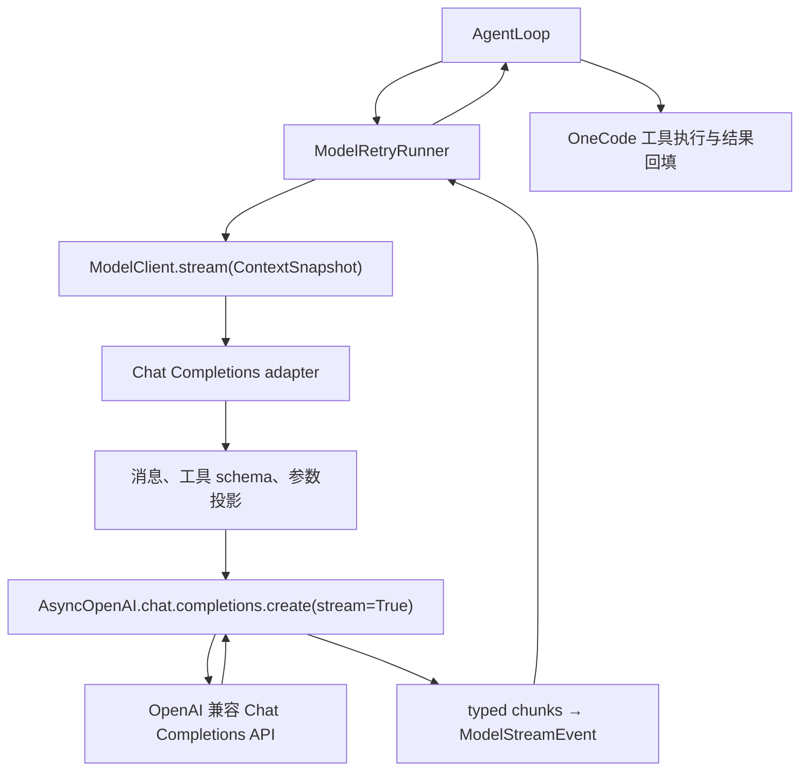

# Model And Provider Architecture

本文定义 OneCode 模型边界的目标设计。OpenAI Python SDK 是 `infrastructure/providers/` 内的标准 API 客户端；`core/` 和 `services/` 只依赖 OneCode 的供应商中立协议。标准 Chat Completions 模型流、标准模型发现、`/connect` 标准探测与 SDK client 生命周期均已由 SDK 接管；实施步骤见 [执行计划](../exec-plans/active/openai-sdk-provider-runtime/plan.md)。

## 边界与职责

| 能力 | 目标归属 |
|:---|:---|
| Chat Completions 请求序列化、HTTP 连接、SSE 解码、标准响应对象及 SDK 异常 | OpenAI Python SDK |
| Models API 的标准请求与响应对象 | OpenAI Python SDK |
| `.env` 解析、供应商目录、base URL 和候选端点选择 | `infrastructure/config/` 与 `infrastructure/providers/` |
| `ContextSnapshot` 到模型消息和工具 schema 的投影 | `infrastructure/providers/chat_completions.py` |
| typed chunk 到 `ModelStreamEvent`、工具参数聚合及 usage 映射 | `infrastructure/providers/chat_completions.py` |
| SDK 异常到 `ProviderError` 的归一化 | `infrastructure/providers/` 边界 |
| 重试决策、退避、trace、上下文压缩与可见状态 | OneCode runtime |
| 工具权限、guard、hook、执行和工具结果续轮 | OneCode runtime |
| Ollama 原生 `/api/tags`、`/api/chat` 等非 OpenAI API 请求 | `infrastructure/providers/` 的隔离 HTTP 路径 |

本次标准协议是 OpenAI Chat Completions 与 Models API。OpenAI 兼容服务满足这些协议时，通过配置接入；OneCode 不按供应商维护额外响应解析或兼容分支。Responses API、托管 Agents SDK 与新增多模态能力不属于此边界变更。SDK 仅解决 API 客户端职责，不接管 agent 运行时。

## 文件职责

| 文件 | 目标职责 |
|:---|:---|
| `services/model/client.py` | `ModelClient.stream(snapshot) -> AsyncIterator[ModelStreamEvent]` 协议 |
| `services/model/stream.py` | 供应商中立的 `ModelStreamEvent` |
| `services/model/types.py` | `ProviderError`、`ModelUsage`、`LLMResponse` |
| `services/model/retry.py` | `ModelRetryRunner`、`RetryPolicy`、`RetryDecision`；非缓冲重试 |
| `infrastructure/config/env.py` | 仅从项目 `.env` 解析 `ResolvedProviderConfig` |
| `infrastructure/providers/catalog.py` | 内置配置目录、标准端点默认值及非标准端点标识 |
| `infrastructure/providers/factory.py` | 创建 SDK client 和 OneCode adapter，注入配置与测试 HTTP client |
| `infrastructure/providers/chat_completions.py` | 生成 SDK Chat Completions 请求，消费 typed chunks，输出 OneCode 事件 |
| `infrastructure/providers/model_catalog.py` | 选择 `/models` 候选、调用 SDK Models resource、整理 `ProviderModel`；保留原生端点探测 |
| `infrastructure/providers/http.py` | 仅保留非标准 API 所需的通用 HTTP 请求与共享错误归一化；不实现标准模型请求或 SSE parser |
| `infrastructure/providers/connection.py` | `/connect` 的供应商选项辅助信息 |
| `application/runtime.py`、`application/session.py` | 拥有、共享、热重载和关闭模型 SDK client |

`services/errors.py` 仍是标准库依赖的通用错误分类层。SDK 类型与异常仅允许出现在 infrastructure 内；`core/`、`services/`、工具和 UI 不导入 SDK，也不解析其私有字段。

## 供应商中立接口

`ModelStreamEvent` 可为 `content_delta`、`tool_call_delta`、`tool_call_completed`、`message_completed`、`usage`、`error`。`message_completed` 保留完整 `assistant_message`、`final_text`、`stop_reason`、`usage`、`output_interrupted`，其 `metadata["tool_calls"]` 是主循环判定工具续轮的依据。适配器不得把 SDK chunk、SDK tool-call 类型或 HTTP response 作为事件内容向上传递。

`ProviderError` 继承 `OneCodeError`，携带 `provider_id`、`status_code`、`error_type`、`retryable` 和可选 `retry_after_seconds`。适配器负责在发起请求及消费流两个阶段把 SDK 的连接、超时、状态码和响应解码异常转成该类型；取消原样传播。`ModelUsage` 保留 `input_tokens`、`output_tokens`、`cache_read_input_tokens`、`cache_creation_input_tokens`。缺失 usage 时流仍可正常结束；没有可靠来源的缓存字段保留零值。

`ResolvedProviderConfig` 保留 `provider`、`provider_id`、`display_name`、`base_url`、`model`、`api_key`、`timeout_seconds`、`headers`、`default_params`、`models_path`、`chat_completions_path`。`load_provider_config()` 仍只读取项目 `.env`：`ONECODE_PROVIDER_ID` 选择供应商，`<PREFIX>_MODEL`、`<PREFIX>_API_KEY`、`<PREFIX>_BASE_URL` 提供其参数，`ONECODE_TIMEOUT_SECONDS` 默认 60 秒，`ONECODE_EXTRA_HEADERS` 与 `ONECODE_DEFAULT_PARAMS` 是可选配置。SDK 的 `OPENAI_API_KEY`、`OPENAI_BASE_URL` 等环境变量不能成为 OneCode 的隐式配置源。无密钥的本地兼容端可以给 SDK 构造器一个非秘密占位值。

## 模型调用数据流

`ContextSnapshot.system_prompt` 是首条 system message；`tool_result` 投影为带 `tool_call_id` 的 tool message；其余模型可见消息保留结构。内部 `attachment` role 必须先由 context preparer 投影并隐藏，不能泄漏到 SDK 请求。`tool_schemas` 来自 OneCode 的可见工具视图，不由 SDK 自行发现或执行工具。

OneCode 控制 `model`、`messages`、`tools`、`stream` 和运行时输出上限。`default_params` 中 SDK 已声明的 Chat Completions 可选参数按具名参数传递，协议允许但 SDK 未声明的 JSON 字段经 `extra_body` 传递；不得让配置覆盖这些运行时保留字段。`headers` 作为额外请求头传入，认证由 SDK 的 `api_key` 参数处理。是否请求 stream usage 是明确的请求参数；不能假设结束时一定有 usage chunk。

SDK 的低层 typed chunk 流负责 SSE 解码。adapter 立即发出文本增量，按 tool-call index 合并分片 id、name 与 arguments，校验最终 arguments 为 JSON 对象，然后发出 `tool_call_completed` 和 `message_completed`。`finish_reason` 为 `length`、`max_tokens` 或 `max_output_tokens` 时设置 `output_interrupted=True`，供主循环恢复输出。OneCode 保留工具调用原始 wire 形状，以便写入消息历史并在下一轮与工具结果配对。

## SDK 配置、错误与重试

应用为活跃模型配置创建并复用一个 `AsyncOpenAI`，显式传入 `base_url`、`api_key`、额外 headers、`timeout=config.timeout_seconds` 和 `max_retries=0`。SDK 负责连接、序列化、SSE 与标准错误对象；OneCode 的 `ModelRetryRunner` 是唯一的重试决策者，避免 SDK 默认重试隐藏请求次数。SDK stream 在正常完成、错误、取消和调用方提前停止时均需关闭。

状态码和错误正文在 infrastructure 边界映射：413 或可识别的 context limit 错误为 `context_limit_exceeded` 且不可重试；401/403 为认证错误；429 为限流错误；5xx 为服务端错误；连接与超时为可重试网络/超时错误；无效响应和工具参数为不可重试错误。有效的 `Retry-After` 秒数填入 `retry_after_seconds`，供运行时退避使用。SDK 异常及原始错误正文不得直接越过 provider 边界或进入 trace。

`ModelRetryRunner.stream()` 对每个 attempt 立即转发事件，不缓冲完整回复。若流中途出现可重试 `ProviderError`，先前的文字或工具增量可能已在 UI 可见，随后运行时记录 retry trace、通知状态、退避并开始下一 attempt。达到重试上限抛 `RetryExhaustedError`。`context_limit_exceeded` 不由普通重试处理，交给 `AgentLoop` 的 reactive compact 流程。默认策略保持 `max_retries=10`、基础延时 0.5 秒、上限 32 秒和 0.25 抖动比例。

## 模型发现与连接探测

标准模型列表由 SDK `OpenAI.models.list()` 请求，`model_catalog.py` 把返回对象映射成排序后的 `ProviderModel`。`/connect` 可以按原有顺序尝试候选 base URL，但每个标准 `/models` 请求由 SDK 发出；标准 Chat Completions 连通性请求也由 SDK 发出。探测策略不进入 SDK，也不进入主循环。Ollama 原生 `/api/tags` 列表与 `/api/chat` 探测保留独立 HTTP 请求和格式解析。同步探测所用的 SDK client 在该次操作完成后关闭。

## 客户端生命周期与依赖方向

`application/runtime.py` 创建的模型 adapter 拥有 SDK client；会话重绑定、子 agent、记忆服务借用同一个 adapter，不各建连接池。`application/session.py` 在运行中请求和子任务结束后关闭它。配置热重载先建立新 adapter，成功切换后关闭旧 adapter；失败时关闭新 adapter 并继续使用旧配置。重复关闭应安全，正在消费的流不因热重载被提前关闭。

依赖方向保持 `core/ → services/model/` 的中立契约，`infrastructure/providers/ → services/model/` 等中立类型；应用层负责装配。SDK 只被 infrastructure 导入。模型服务无需知道具体供应商、SDK 版本或 HTTP 实现。

## 实施状态

标准模型边界已迁移完成（Milestone 2 与 3）：`chat_completions.py` 消费 SDK typed chunk 并把 SDK 异常归一化为 `ProviderError`，`factory.py` 按 `ResolvedProviderConfig` 构建并注入 `AsyncOpenAI`（`max_retries=0`、显式 `timeout`），`services/model/retry.py` 仍是唯一重试决策者。`model_catalog.py` 的标准 `/models` 与 `/connect` 标准 Chat Completions 探测改由同步 SDK client 发出，Ollama 原生端点仍走隔离的通用 HTTP 路径；`http.py` 只保留该路径的 `UrllibHttpTransport` 与共享错误归一化，无调用者的异步传输和 SSE parser 已删除。应用拥有并复用 SDK client：`application/session.py` 在 worker、子任务与流结束后关闭它，热重载先构建新 client、成功安装后关闭旧 client、失败时关闭新 client。以[执行计划](../exec-plans/active/openai-sdk-provider-runtime/plan.md)及其 progress 追踪交付与剩余验收。
